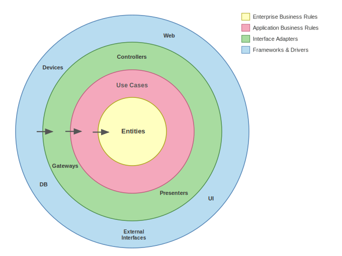

# Clean Architecture

OCUDU is built on [Clean Architecture](https://blog.cleancoder.com/uncle-bob/2012/08/13/the-clean-architecture.html) principles introduced by Robert C. Martin. The core idea is to organise code into concentric layers where **dependencies always point inward** - from low-level infrastructure details toward high-level business rules - and never the other way around.

## The dependency rule

The single most important rule is: **source code dependencies must point inward only**. An inner layer never knows anything about an outer layer. This means:

- High-level business logic does not depend on frameworks, databases, or I/O.
- Business rules can be tested without spinning up any external infrastructure.
- Swapping out an outer-layer component (e.g. a radio driver) does not require touching inner-layer code.

*Reproduced from Robert C. Martin, ["The Clean Architecture"](https://blog.cleancoder.com/uncle-bob/2012/08/13/the-clean-architecture.html), 2012. The original diagram and article are © Robert C. Martin.*

## Layers in OCUDU

OCUDU maps the Clean Architecture rings directly onto the 5G NR protocol stack, from highest to lowest abstraction:

| Abstraction | Layer | What lives here | OCUDU folders |
|---|---|---|---|
| Highest | **Protocol entities** | Pure 3GPP TS implementations: protocol state machines, data plane processing, radio resource scheduling | `mac/`, `rlc/`, `pdcp/`, `rrc/`, `sdap/`, `scheduler/`, upper `phy/` |
| ↑ | **Functional units** | gNB component orchestration: coordinates protocol entities, manages UE contexts, drives cell bring-up and tear-down | `cu_cp/`, `cu_up/`, `du/` |
| ↓ | **Interface adaptors** | 3GPP signalling stacks and boundary glue: adapts internal interfaces to wire protocols and external systems | `f1ap/`, `ngap/`, `e1ap/`, `e2/`, `fapi_adaptor/`, `gateways/`, `ofh/` |
| Lowest | **Infrastructure** | Platform utilities, radio drivers, DSP primitives, observability: everything the upper layers are built on but do not depend on directly | `adt/`, `support/`, `ran/`, `hal/`, `radio/`, `ocuduvec/`, `ocudulog/`, `asn1/`, `security/`, `pcap/` |

`apps/` sits above all layers as the composition root — it creates and wires the functional units, adaptors, and infrastructure together at startup.

The key constraint: **lower abstraction modules depend on higher abstraction modules, not the reverse**.

## Separation of concerns

Mixing code from different abstraction layers (and also between
blocks within the same abstraction layer) is actively avoided:

- Keep abstraction layer boundaries and interfaces clean and narrow.
- Minimise coupling between modules at different abstraction levels.
- Use interfaces (abstract C++ classes) as the contract at every boundary. This decouples data from behaviour, enables mocking in tests, and allows CPU-optimised implementations to be swapped in without changing business logic.

## Dependency inversion at the boundary

When the direction of control flow would force an inner layer to call outward, the **Dependency Inversion Principle** is applied. The inner layer defines an interface; the outer layer implements it. This keeps the dependency arrow pointing inward even when control flows outward.

A concrete example from OCUDU: when the RLC AM entity exhausts its retransmission budget (`max_retx`), it must tell the DU-high to initiate a UE release. RLC is an inner layer; DU-high is an outer layer. RLC must never hold a pointer to DU-high — that would be an outward dependency.

Instead, RLC defines the `rlc_tx_upper_layer_control_notifier` interface (in `include/ocudu/rlc/rlc_tx.h`) with an `on_max_retx()` method. The DU-high implements this interface through `rlc_tx_control_notifier` (in `du/du_high/du_manager/du_ue/du_ue_adapters.h`) and passes it into the RLC entity at construction time.

At runtime, control flows inward-to-outward: RLC → `on_max_retx()` → DU-high. At compile time, the dependency arrow still points inward: DU-high includes the RLC header to implement the interface; RLC includes nothing from DU-high.

## What this means for contributors

When adding a feature, decide which layer it belongs to before writing any code:

- **New radio hardware** → touch only the infrastructure layer (`hal/`, `radio/`, `ofh/`). The protocol stack above never changes.
- **New full L1 (third-party or custom)** → implement the `split6_o_du_low_plugin` interface (`apps/units/flexible_o_du/split_6/o_du_low/split6_o_du_low_plugin.h`). Your L1 exposes FAPI P5/P7 adaptors; OCUDU's DU-high connects to them without knowing what is behind the interface. No changes to MAC or above.
- **New PHY algorithm (e.g. channel estimator)** → implement the `port_channel_estimator` or `dmrs_pusch_estimator` interface (`include/ocudu/phy/upper/signal_processors/channel_estimator/`), register it via the factory, and add your implementation under `lib/phy/upper/signal_processors/channel_estimator/`. The PUSCH pipeline that calls `compute()` is unchanged.
- **New protocol behaviour** → touch only the protocol entities or functional units (`mac/`, `rlc/`, `cu_cp/`, etc.). Infrastructure and adaptors are unaffected.

Keeping changes scoped to the correct layer is what allows the codebase to stay portable, testable, and maintainable as it grows.

## Benefits at a glance

- **Portability**: C++ codebase runs across different platforms; hardware dependencies are isolated to the lowest layer.
- **Testability**: Business rules are tested without external components by mocking interface implementations.
- **Decoupled NR layers**: MAC, RLC, PDCP, and other NR layers are completely decoupled from each other through interfaces.
- **3rd-party integration**: External PHYs connect via FAPI; the rest of the stack is unaffected.
- **Flexible execution**: Memory and threading resources are configurable without touching business logic.
- **CPU optimisation**: Interface-based design allows swapping a generic implementation for a SIMD-optimised one without changing call sites.
