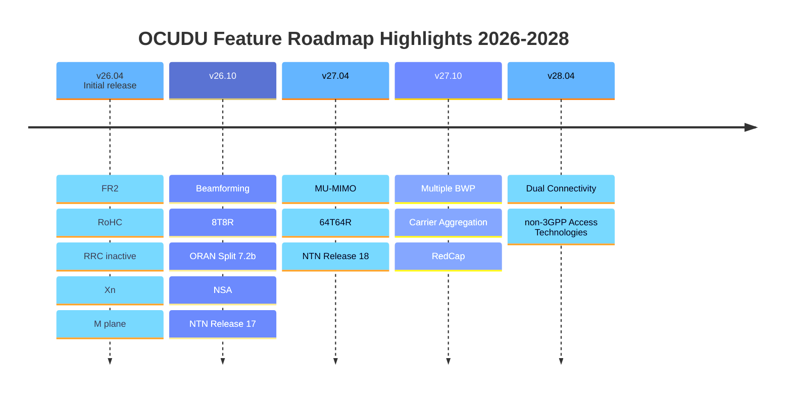

# Features and Roadmap

OCUDU is an open-source initiative that has been awarded initial funding by the National Spectrum Consortium (NSC) under a three-year program running through October 2028.
See [here](https://www.nationalspectrumconsortium.org/news-detail/ocudu-awardees-deepsig-srs)
for more details.

The project follows a clearly defined development roadmap covering the full period of performance.
The first public release is scheduled for April 2026. Beginning with that release, we will adopt a 
predictable bi-annual release cycle, issuing new versions every April and October to ensure steady 
feature development, community feedback integration, and long-term sustainability.

* [Current Features](2_features_and_roadmap.md#current-features)
* [Roadmap](2_features_and_roadmap.md#roadmap)

## Current Features

* 3GPP release 17 aligned
* FDD/TDD supported, all FR1 bands
* All bandwidths (e.g. 100 MHz TDD, 50 MHz FDD)
* 15/30 kHz subcarrier spacing
* All physical channels
* Highly optimized LDPC and Polar encoder/decoder for ARM Neon and x86 AVX2/AVX512
* All RRC procedures
* All MAC procedures
* Intra-DU/Intra-CU and Intra-CU handover over the NG interface
* Split 7.2a support using in-house open-fronthaul (OFH) library
* Support for QAM-256
* 4x4 MIMO in the Downlink
* SSB-based radio link monitoring
* Slicing
* NTN GEO support
* CU/DU and CU-CP/CU-UP separation

The features above are fully implemented and available today.

## Roadmap

The roadmap items listed below are currently planned with allocated engineering resources and a defined delivery timeline. However, this roadmap is not fixed. With additional engineering capacity
and collaborative contributions, priorities and timelines can be adjusted. If there are features within the OCUDU scope that are not currently listed but are important to you or your organization, we welcome discussions on accelerating, expanding, or (re-)prioritizing development through resource support and joint contribution.

### Coming in 26.04

* UL MIMO
* NRPPa using RSRP and SRS
* Xn and Conditional HO
* FR2 120 KHz
* PRACH formats A3, C0 and C2
* Robust Header Compression (RoHC)
* Support for RRC_INACTIVE
* SRS aperiodic and narrowband
* CSI-RS based RL monitoring
* M-plane
* Hardware accelerator support through DPDK BBDEV

### Coming in 26.10

* Beamforming
* 8T8R
* NR Positioning: Angle-based and DL-PRS
* ORAN Split 7.2b support
* 2-step RACH
* Non-standalone (NSA) with third-party eNodeB
* NTN Release 17

### Coming in 27.04

* MU-MIMO, 16 DL / 8 UL layers 
* Up to 64T64R
* Reciprocity-based Beamforming
* SRS Antenna Switching
* EPS Fallback
* NTN Release 18

### Coming in 27.10

* Multiple BWP
* Carrier Aggregation up to 8 CC DL and 4 CC UL
* Emergency Call Priorization 
* SRS Coverage Enhancements
* Release 17 Type-II codebook Enhancements
* RedCap

### Coming in 28.04

* Dual Connectivity
* UL Tx switching
* S-NPN and NPI-NPN
* Support for non-3GPP Access Technologies

### Coming in 28.10

* Final optimizations and refinements
* Preparations for final External Test and Validation
