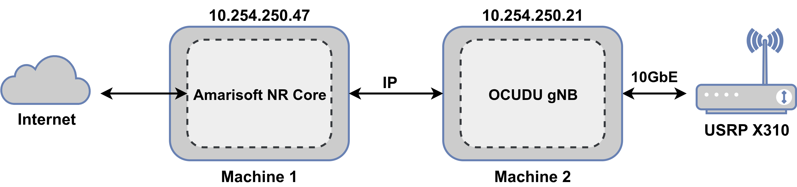

# Amarisoft NR Core

## Overview

Amarisoft runs on standard off-the-shelf x86/ARM hardware and standard Linux distributions. The source code is proprietary and protected by commercial software licenses. The Amarisoft NR core includes key 5G core elements such as AMF, SMF, UPF, NRF, AUSF, UDM, and an integrated IMS server for VoNR/VoLTE voice calls.

This guide describes how to connect OCUDU to an Amarisoft NR core when the gNB and core network run on separate Linux hosts. You can also co-host OCUDU with the Amarisoft NR core on a single machine.



## Resources
- [Amarisoft LTE and NR Core Network](https://tech-academy.amarisoft.com/ltemme.doc)
- [Amarisoft LTE Software eNodeB and NR Software gNB](https://tech-academy.amarisoft.com/lteenb.doc)

## Prerequisites

The deployment requires the following components:

- PC running Ubuntu 22.04 or later
- OCUDU CU/DU (commit `e5190292f6` or later)
- [Amarisoft NR Core](https://amarisoft.com/technology#4g-5g-core) (version `2025-09-19` or later)
- [USRP X310](https://www.ettus.com/all-products/x310-kit/) connected over a 10GbE interface
- IP connectivity between the Amarisoft NR core host and the OCUDU host

## 1. Configure Amarisoft NR Core

This tutorial uses Amarisoft core version `2025-09-19`. The Amarisoft release archive `amarisoft.2025-09-19.tar.gz` contains the archive `ltemme-linux-2025-09-19.tar.gz`. Extract this archive before proceeding. You can run the Amarisoft core directly from the unpacked directory without an explicit installation step. For more details, read the [installation guide](https://tech-academy.amarisoft.com/ltemme.doc#7cd8fb6e31cc946c078d2740c76a9899-9).

The `ltemme` binary inside the `ltemme-linux-2025-09-19` directory initializes the core. The `config` folder contains example configuration files.

This tutorial uses the `mme.cfg` configuration file. Set the [gtp_addr](https://tech-academy.amarisoft.com/ltemme.doc#prop.gtp_addr) parameter to the IP address of the local network interface connected to the core network. The parameter defaults to `localhost` when co-hosting the gNB and core network on the same machine. Match the [nssai](https://tech-academy.amarisoft.com/ltemme.doc#prop.nssai) slices between the core and the gNB. The `mme.cfg` configuration file defaults to `plmn: "00101"` and `sst: 1`. Configure the same values in OCUDU gNB.

```c
  gtp_addr: "10.254.250.47", // Local IP bound by the Amarisoft core for OCUDU gNB traffic.
```
Configure the subscriber details in the `ue_db`section. Use the [count](https://tech-academy.amarisoft.com/ltemme.doc#prop.ue_db.count) parameter to generate a batch of 128 subscribers by auto-incrementing the base `imsi` and `K` values. Alternatively, list each subscriber entry individually in the JSON configuration file.
```c
ue_db: [
    {
        sim_algo: "milenage",
        imsi: "001010000000001",
        K: "fec86ba6eb707ed08905757b1bb44b8f",
        opc: "C42449363BBAD02B66D16BC975D77CC1",
        amf: 0x9001,
        sqn: "000000000000",
        count: 128,
    },
],
```
Start the Amarisoft core:
```shell
./ltemme config/mme.ocudu.cfg
```

A successful startup displays the following terminal output:
```shell
Warning: GTP-U receive buffer set to 425984 instead of 5242880
Warning: GTP-U send buffer set to 425984 instead of 5242880
You may launch lte_init.sh script
(mme) 
```

## 2. Configure OCUDU

Install OCUDU by following the [OCUDU installation guide.](https://gitlab.com/ocudu/ocudu_docs/-/blob/main/docs/user_manual/installation/installation.md).

Use the following OCUDU parameters to connect to a remote Amarisoft core host:
```yml
cu_cp:
  amf:
    addrs: 10.254.250.47        # IP address of the remote Amarisoft core (AMF) machine
    bind_addrs: 10.254.250.21   # Local IP address of gNB reachable by the Amarisoft core
    supported_tracking_areas:
      - tac: 1
        plmn_list:
          - plmn: "00101"
            tai_slice_support_list:
              - sst: 1

```
Start OCUDU gNB from the build directory using the updated configuration file:
```shell
sudo ./apps/gnb/gnb -c gnb_rf_x310_tdd_n78_40mhz.yml
```
The console output should be similar to the following:
```shell
--== OCUDU gNB (commit e5190292f6) ==--

Lower PHY in triple executor mode.
Available radio types: uhd, zmq and realtime_loopback.
[INFO] [UHD] linux; GNU C++ version 11.4.0; Boost_107400; DPDK_21.11; UHD_4.8.0.HEAD-0-g308126a4
[INFO] [LOGGING] Fastpath logging disabled at runtime.
Making USRP object with args 'type=x300,addr=192.168.40.2,send_frame_size=8000,recv_frame_size=8000,num_send_frames=512,num_recv_frames=512,master_clock_rate=184.32e6'
[INFO] [X300] X300 initialization sequence...
[INFO] [X300] Maximum frame size: 8000 bytes.
[INFO] [GPS] Found an internal GPSDO: LC_XO, Firmware Rev 0.929a
[INFO] [X300] Radio 1x clock: 184.32 MHz
Setting USRP time to 1788992613s
[INFO] [MULTI_USRP]     1) catch time transition at pps edge
[INFO] [MULTI_USRP]     2) set times next pps (synchronously)
[WARNING] [0/Radio#0] Attempting to set tick rate to 0. Skipping.
Cell pci=1, bw=40 MHz, 1T1R, dl_arfcn=632628 (n78), dl_freq=3489.42 MHz, dl_ssb_arfcn=631680, ul_freq=3489.42 MHz

N2: Connection to AMF on 10.254.250.47:38412 completed
Remote control server listening on 0.0.0.0:8001
==== gNB started ===
Type <h> to view help
```

The gNB detects the USRP X310 and establishes an N2 connection to the Amarisoft core. Execute the `ng_ran` command in the Amarisoft MME console to verify active NG-RAN nodes connected over N2/NGAP:
```shell
(mme) ng_ran 
  PLMN     RAN_ID                        IP:Port #UEctx     TACs
 00101      0x19b            10.254.250.21:46242      0      0x1
```
This output verifies the OCUDU PLMN and IP connection. The UE context count remains zero until a UE connects to OCUDU.

## 3. Connect a 5G device

Program the SIM card with the subscriber credentials configured in the Amarisoft core `ue_db`.

This setup uses [Amarisoft UE](https://docs.ocudu.org/tutorials/amari_ue/) to verify RF and core connectivity. The following console output shows a successful connection to OCUDU and registration with the Amarisoft core:
```shell
RF0: sample_rate=61.440 MHz dl_freq=3489.420 MHz ul_freq=3489.420 MHz (band n78) dl_ant=1 ul_ant=1
/dev/sdr0 initialized (15s) (tries=0)
Waiting for GPS lock...
/dev/sdr0 Locked on GPS (1)
(ue) Cell 0: SIB found

(ue) 
(ue) cells
Cell #0 / NR:
  PCI:    1
  TDD:    config=0, ssf=0
  EARFCN: DL=632628 UL=632628
  RB:     DL=106 UL=106
  SFN:    1.732.13
(ue) power_on 1
(ue) ue 1
        # UE_ID CL RNTI    RRC_STATE               EMM_STATE #ERAB IP_ADDR
  NR          1  0 4601      running              registered     1 192.168.4.2 CID 0
```

Execute `ng_ran` in the Amarisoft MME console to verify the active UE context on the OCUDU gNB:
```shell
(mme) ng_ran 
  PLMN     RAN_ID                        IP:Port #UEctx     TACs
 00101      0x19b            10.254.250.21:46242      1      0x1
```
Execute `uectx` to inspect N2 control-plane bindings:
```shell
(mme) uectx
 CN_UE_ID   RAN_ID RAN_UE_ID M-TMSI/5G-TMSI
      100    0x19b         0     0x5c51a253
```
Execute `ue` to inspect subscriber state and N3 user-plane bearer details:
```shell
(mme) ue
            SUPI           IMEISV  CN M-TMSI/5G-TMSI REG           TAC #BEARER IP_ADDR
 001010000000001 0123456700000101 5GC     0x5c51a253   Y  00101.   0x1       1 internet/192.168.4.2
```

## Conclusion

This tutorial validates cross-platform integration between the Amarisoft NR core and OCUDU gNB across separate hosts. The UE successfully completes 5GS registration, establishes a PDU session, and receives an IP address for user-plane traffic.

