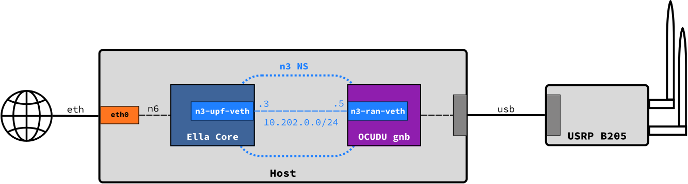
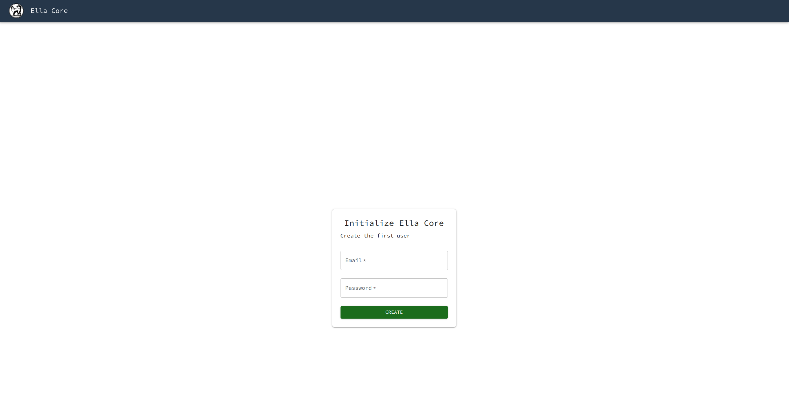
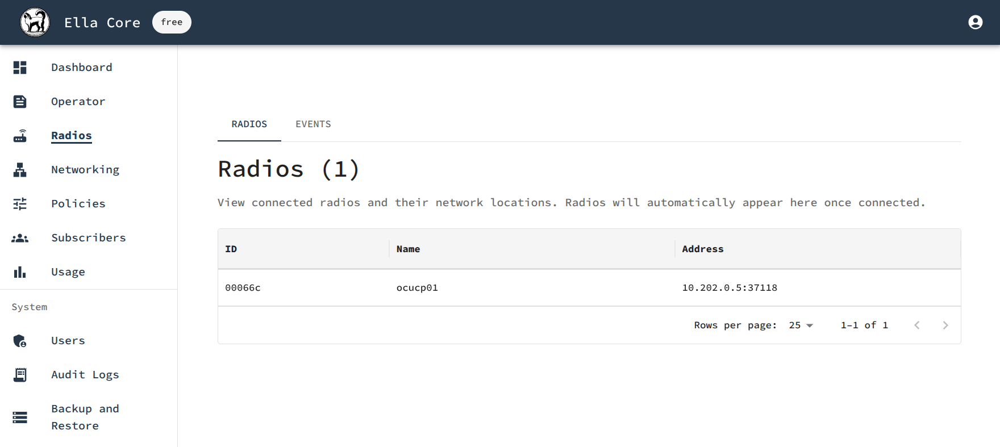

# Ella Core

## Overview

[Ella Core](https://github.com/ellanetworks/core) is an open-source 5G Core designed for private networks. It ships as a single binary, supports both amd64 and arm64 architectures, and leverages eBPF for high-performance packet processing. Ella Core includes a built-in UI and HTTP API for management and monitoring. OCUDU can either be co-hosted with Ella Core for an all-in-one 5G network, or installed on a different machine. This guide outlines how-to co-host OCUDU and Ella Core.



### Resources

- [Ella Core Documentation](https://docs.ellanetworks.com/)
- [Ella Core GitHub Repository](https://github.com/ellanetworks/core)

---

## Pre-requisites

- A computer with a Linux-based OS
  - CPU: 4 cores  (amd64 or arm64)
  - Memory: 8 GB RAM
  - Storage: 20 GB free disk space
  - Kernel: 6.8 or later
- USRP B205 mini (or any other OCUDU-supported RF front-end)

---

## 1. Create a network namespace for N3

Connect to the host and create a Linux network namespace `n3ns` for the N3 interface between OCUDU and Ella Core.

```shell
ip netns add n3ns
ip link add n3-upf-veth type veth peer name n3-ran-veth
ip link set n3-ran-veth netns n3ns
ip addr add 10.202.0.3/24 dev n3-upf-veth
ip -n n3ns addr add 10.202.0.5/24 dev n3-ran-veth
ip -n n3ns link set lo up
ip -n n3ns link set dev n3-ran-veth up
ip link set dev n3-upf-veth up
```

## 2. Install Ella Core

Install Ella Core:

```shell
sudo snap install ella-core
sudo snap connect ella-core:network-control
sudo snap connect ella-core:process-control
sudo snap connect ella-core:system-observe
sudo snap connect ella-core:firewall-control
```

:::note
You can also install Ella Core from source or using Docker. For more details, refer to the [Ella Core installation guide](https://docs.ellanetworks.com/how_to/install/).
:::

Edit the configuration file located at `/var/snap/ella-core/common/core.yaml`. Adapt the N2 and N3 interfaces to use `n3-upf-veth`, and N6 to use the system's physical NIC. All configuration parameters are explained in the [Ella Core configuration reference](https://docs.ellanetworks.com/reference/config_file/). For example:

```yaml {11,14,16}
logging:
  system:
    level: "info"
    output: "stdout"
  audit:
    output: "stdout"
db:
  path: "core.db"
interfaces:
  n2:
    name: "n3-upf-veth"
    port: 38412
  n3:
    name: "n3-upf-veth"
  n6:
    name: "eth0"
  api:
    address: "0.0.0.0"
    port: 5002
xdp:
  attach-mode: "generic"
telemetry:
  enabled: false
```

:::note
If your host's NICs support XDP, edit the XDP attach-mode to `native` for better performance.
:::

Start Ella Core:

```shell
sudo snap start ella-core --enable
```

## 3. Initialize Ella Core

Open your browser at the system's IP address on port 5002, you should see the initialization screen.



Navigate to the Operator tab and set your MCC and MNC. Here we will be using 999–01.

Navigate to the Subscribers tab and create a new subscriber. You can click “Generate” to get randomly generated values for IMSI, Key, and OPc.

## 4. Install OCUDU

Install OCUDU using the [OCUDU installation guide](../../installation/installation.md).

In the OCUDU configuration file, use the addresses we defined when creating the `n3ns` namespace and the same PLMN ID configured in Ella Core. For example:

```yaml {3,5,9,19,33}
cu_cp:
  amf:
    addr: 10.202.0.3
    port: 38412
    bind_addr: 10.202.0.5
    supported_tracking_areas:
      - tac: 1
        plmn_list:
          - plmn: "99901"
            tai_slice_support_list:
              - sst: 1
  inactivity_timer: 300
  security:
    nea_pref_list: nea2,nea1
    nia_pref_list: nia2,nia1
cu_up:
  ngu:
    socket:
      - bind_addr: 10.202.0.5
ru_sdr:
  device_driver: uhd
  device_args: type=b200
  clock: internal
  srate: 23.04
  tx_gain: 80
  rx_gain: 40

cell_cfg:
  dl_arfcn: 665000
  band: 77
  channel_bandwidth_MHz: 20
  common_scs: 30
  plmn: "99901"
  tac: 1
  pdcch:
    dedicated:
      ss2_type: common
      dci_format_0_1_and_1_1: false
  prach:
    prach_config_index: 160
  pdsch:
    mcs_table: qam64
  pusch:
    mcs_table: qam64

log:
  filename: /tmp/gnb.log
  all_level: info

pcap:
  mac_enable: enable
  mac_filename: /tmp/gnb_mac.pcap
  ngap_enable: enable
  ngap_filename: /tmp/gnb_ngap.pcap
```

Start OCUDU’s gnb in the `n3ns` namespace:

```shell
sudo ip netns exec n3ns ./gnb -c gnb.yaml
```

You should see the gnb detecting the B205 mini and connecting to Ella Core:

```shell
--== OCUDU gNB (commit d1ca6d2744) ==--

2026-02-16T18:34:35.963576 [GNB     ] [I] Built in Release mode using commit d1ca6d2744 on branch dev
Lower PHY in dual baseband executor mode.
Available radio types: uhd.
[INFO] [UHD] linux; GNU C++ version 13.2.0; Boost_108300; UHD_4.6.0.0+ds1-5.1ubuntu0.24.04.1
Making USRP object with args 'type=b200'
[INFO] [LOGGING] Fastpath logging disabled at runtime.
[INFO] [B200] Detected Device: B205mini
[INFO] [B200] Operating over USB 3.
[INFO] [B200] Initialize CODEC control...
[INFO] [B200] Initialize Radio control...
[INFO] [B200] Performing register loopback test... 
[INFO] [B200] Register loopback test passed
[INFO] [B200] Setting master clock rate selection to 'automatic'.
[INFO] [B200] Asking for clock rate 16.000000 MHz... 
[INFO] [B200] Actually got clock rate 16.000000 MHz.
[INFO] [MULTI_USRP] Setting master clock rate selection to 'manual'.
[INFO] [B200] Asking for clock rate 23.040000 MHz... 
[INFO] [B200] Actually got clock rate 23.040000 MHz.
Cell pci=1, bw=20 MHz, 1T1R, dl_arfcn=665000 (n77), dl_freq=3975 MHz, dl_ssb_arfcn=664704, ul_freq=3975 MHz

N2: Connection to AMF on 10.202.0.3:38412 completed
Remote control server listening on 0.0.0.0:8001
==== gNB started ===
```

You should see the radio in Ella Core’s UI:



## 5. Connect a 5G device

Burn the SIM card with the same information you used to create the subscriber in Ella Core.

Insert the SIM card into the phone.

Configure the phone with “internet” as its APN and ensure it is set to “5G Standalone”.

The phone should now connect to the 5G network.

<div style={{textAlign: 'center'}}>
  
</div>

## Conclusion

You have successfully set up a 5G network using OCUDU and Ella Core and connected a 5G device to it!
