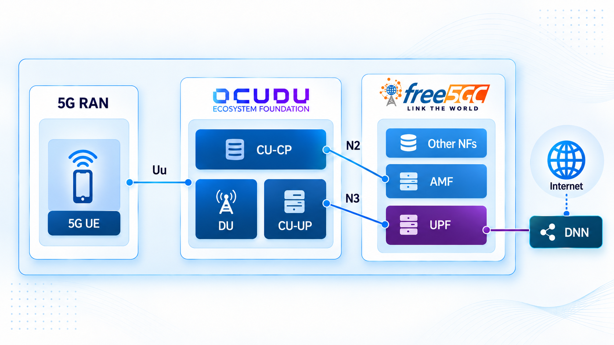
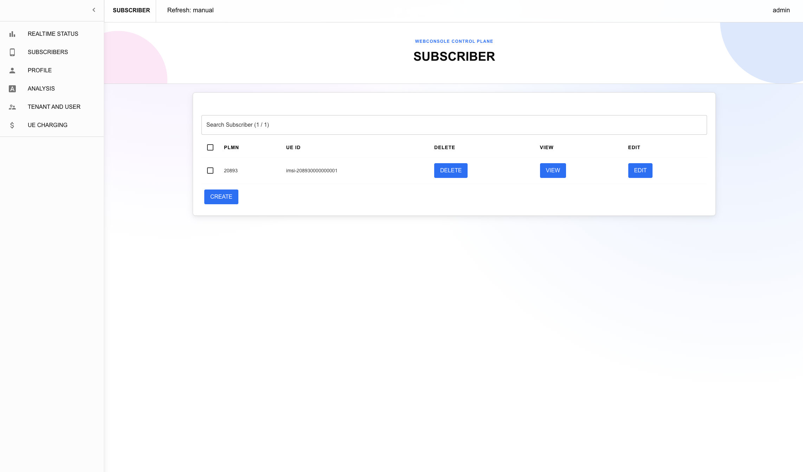
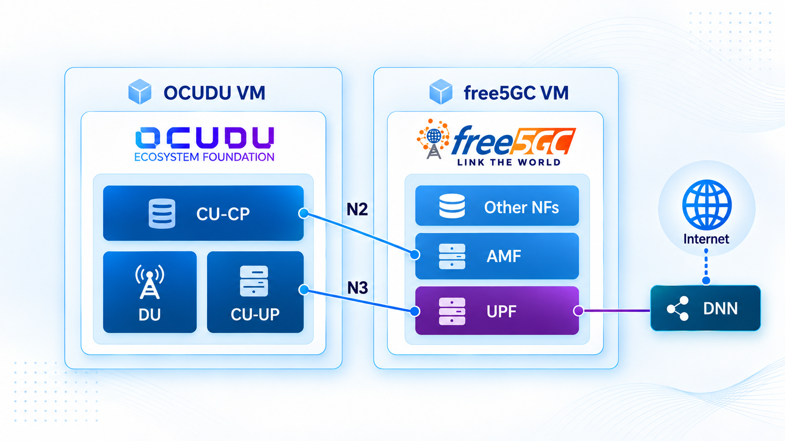

# free5GC

## Overview

[free5GC](https://free5gc.org) is an open-source 5G Core network implementation that originated at WireLab, [National Yang Ming Chiao Tung University (NYCU)](https://www.nycu.edu.tw/nycu/en/index) in Taiwan, and is now a [Linux Foundation](https://www.linuxfoundation.org/) project. It supports 3GPP Release 17 and beyond and provides a modular, cloud-native platform for developing, testing, and integrating 5G networks.

This guide deploys free5GC with [free5gc-compose](https://github.com/free5gc/free5gc-compose) and connects OCUDU's CU-CP and CU-UP to it. Once the CU is connected, attach any DU and UE combination OCUDU supports: a ZeroMQ software UE, a physical O-RAN radio unit, or a COTS device.



:::note
This guide uses free5gc-compose to deploy free5GC in Docker. To build and run free5GC in host mode instead, see [Integration free5GC and OCUDU with ZeroMQ](https://free5gc.org/blog/20260619/20260619/).
:::

### Resources

- [free5GC website](https://free5gc.org)
- [free5GC GitHub](https://github.com/free5gc)

---

## Pre-requisites

- Ubuntu-based 22.04 (or later) VM or host
- CPU: 4 cores or more
- RAM: 16 GB or more

Connecting a DU and UE has its own prerequisites, covered in the tutorial for the RAN setup you choose in [step 3](#3-connect-a-du-and-a-ue).

---

## 1. Deploy free5GC

Clone `free5gc-compose` and set up the environment:

```bash
git clone https://github.com/free5gc/free5gc-compose.git
cd free5gc-compose
./env-setup.sh
```

:::note
The setup script automatically installs `gtp5g` and Docker if they aren't already present. If you started from an empty environment, log out and log back in so the `docker` group takes effect.
:::

Start the compose stack from the `free5gc-compose` directory:

```bash
docker compose up
```

The compose stack assigns fixed addresses to AMF and UPF:

- AMF: `10.100.200.16`
- UPF: `10.100.200.2`

Open a new terminal and confirm the CU can reach AMF over Docker's network bridge:

```bash
ip -4 addr show br-free5gc

# expect to see
# 4: br-free5gc: <BROADCAST,MULTICAST,UP,LOWER_UP> mtu 1500 qdisc noqueue state UP group default
# inet 10.100.200.1/24 brd 10.100.200.255 scope global br-free5gc
#    valid_lft forever preferred_lft forever
```

Ping AMF and UPF from the host:

```bash
ping 10.100.200.16 -c 3

# expect to see
# PING 10.100.200.16 (10.100.200.16) 56(84) bytes of data.
# 64 bytes from 10.100.200.16: icmp_seq=1 ttl=64 time=0.082 ms
# 64 bytes from 10.100.200.16: icmp_seq=2 ttl=64 time=0.086 ms
# 64 bytes from 10.100.200.16: icmp_seq=3 ttl=64 time=0.078 ms
#
# --- 10.100.200.16 ping statistics ---
# 3 packets transmitted, 3 received, 0% packet loss, time 2052ms
# rtt min/avg/max/mdev = 0.078/0.082/0.086/0.003 ms

ping 10.100.200.2 -c 3

# expect to see
# PING 10.100.200.2 (10.100.200.2) 56(84) bytes of data.
# 64 bytes from 10.100.200.2: icmp_seq=1 ttl=64 time=0.137 ms
# 64 bytes from 10.100.200.2: icmp_seq=2 ttl=64 time=0.046 ms
# 64 bytes from 10.100.200.2: icmp_seq=3 ttl=64 time=0.047 ms
#
# --- 10.100.200.2 ping statistics ---
# 3 packets transmitted, 3 received, 0% packet loss, time 2042ms
# rtt min/avg/max/mdev = 0.046/0.076/0.137/0.042 ms
```

## 2. Configure and run OCUDU

Set up the configuration directory:

```bash
mkdir -p ~/ocudu-config
```

Install OCUDU by following the [OCUDU Installation Guide](../../../user_manual/installation/installation.md).

Create `~/ocudu-config/cu_cp.yml`, pointing the CU-CP at free5GC's AMF. The compose stack always assigns AMF the address `10.100.200.16`; `bind_addr` is the host's own address on the `br-free5gc` bridge:

```yaml
cu_cp:
  amf:
    addr: 10.100.200.16        # AMF's address, fixed by free5gc-compose.
    port: 38412
    bind_addr: 10.100.200.1    # The host's own address on the br-free5gc bridge.
    supported_tracking_areas:
      - tac: 1
        plmn_list:
          - plmn: "20893"      # Must match free5GC's PLMN.
            tai_slice_support_list:
              - sst: 1
                sd: "010203"   # Must match a slice free5GC advertises.
  e1ap:
    bind_addr: 127.0.20.1
  f1ap:
    bind_addr: 127.0.10.1
```

Create `~/ocudu-config/cu_up.yml`, pointing the CU-UP's N3 interface at the same bridge address so free5GC's UPF can reach it:

```yaml
cu_up:
  e1ap:
    cu_cp_addr: 127.0.20.1
    bind_addr: 127.0.20.2
  ngu:
    socket:
      - bind_addr: 10.100.200.1 # Reachable by free5GC's UPF over the br-free5gc bridge.
  f1u:
    socket:
      - bind_addr: 127.0.10.1
```

Run the CU-CP:

```bash
sudo ~/ocudu/build/apps/cu_cp/ocucp -c ~/ocudu-config/cu_cp.yml

# expect to see
# E1: Listening for new connections on bind addresses 127.0.20.1, port 38462...
# N2: Connection to AMF on 10.100.200.16:38412 completed
# F1-C: Listening for new connections on bind addresses 127.0.10.1, port 38472...
# ==== CU-CP started ===
# Type <h> to view help
```

Run the CU-UP:

```bash
sudo ~/ocudu/build/apps/cu_up/ocuup -c ~/ocudu-config/cu_up.yml

# expect to see
# E1: Connection to CU-CP completed (configured addrs 127.0.20.1, port 38462)
# ==== CU-UP started ===
# Type <h> to view help
```

## 3. Connect a DU and a UE

OCUDU's DU and any UE that authenticates against free5GC completes this setup. Point the DU's F1AP config at the CU-CP's `f1ap.bind_addr` above (`127.0.10.1`), and make sure the DU's `plmn` and slice match the CU config. Then follow the tutorial for your RAN setup:

- For a ZeroMQ software UE, with no SDR hardware required, see the [srsUE tutorial](../../../tutorials/srsue/index.md) or the ZeroMQ tab of [Deploying a CU/DU split over F1](../../../tutorials/cu_du_split/index.md) to build and run srsUE. The reference UE config files in those tutorials use credentials that do not match free5GC's default subscriber, so use `~/ocudu-config/ue.conf` below instead:

  ```conf
  #####################################################################
  #                   srsUE configuration file
  #####################################################################

  [rf]
  # Using ZMQ device to connect to the gNB.
  # The ports and srate are configured to match your du_zmq.yml.
  freq_offset = 0
  tx_gain = 50
  rx_gain = 40
  srate = 23.04e6
  nof_antennas = 1

  device_name = zmq
  device_args = tx_port=tcp://127.0.0.1:2001,rx_port=tcp://127.0.0.1:2000,base_srate=23.04e6

  # According to your du_zmq.yml, the gNB is on band 3.
  # The dl_arfcn is 368500, which corresponds to band 3.
  [rat.eutra]
  dl_earfcn = 2850
  nof_carriers = 0

  [rat.nr]
  bands = 3
  nof_carriers = 1
  max_nof_prb = 106
  nof_prb = 106

  [rrc]
  release = 15
  ue_category = 4

  [usim]
  # Matches free5GC's default webconsole subscriber.
  mode = soft
  algo = milenage
  imsi = 208930000000001
  k    = 8baf473f2f8fd09487cccbd7097c6862
  opc  = 8e27b6af0e692e750f32667a3b14605d
  imei = 356938035643803

  [nas]
  apn = internet
  apn_protocol = ipv4

  [slicing]
  enable = true
  nssai-sst = 1
  nssai-sd = 66051

  [gw]
  netns = ue1
  ip_devname = tun_srsue
  ip_netmask = 255.255.255.0

  [gui]
  enable = false

  [log]
  all_level = warning
  filename = ~/ocudu-config/logs/ue.log
  phy_lib_level = none
  all_hex_limit = 32
  ```

- For a physical O-RAN radio unit, see [Connecting an O-RAN RU](../../../tutorials/oranru/index.md).
- For a COTS phone over a USRP, see [Connecting a COTS UE](../../../tutorials/cots_ue/index.md).

Before connecting a UE, create a matching subscriber in free5GC's webconsole. Open a browser at `http://<VM IP>:5000`, log in with the account `admin` and password `free5gc`, then on the Subscribers page click **Create** to add a subscriber with the default values.



Once the UE registers, verify connectivity with a ping test through its tunnel interface, as shown in whichever RAN/UE tutorial you followed.

---

## Conclusion

You have deployed free5GC with free5gc-compose and connected OCUDU's CU-CP and CU-UP to it.

---

## Customized deployment

### Deploy free5GC and OCUDU on separate machines



`free5gc-compose`'s AMF and UPF containers advertise their internal Docker bridge addresses (`10.100.200.16` and `10.100.200.2`) in the NGAP and PFCP signaling they send to the RAN. This means simply publishing ports for these services is not enough: OCUDU's CU-UP would still be told to send N3 GTP-U traffic to UPF's internal address `10.100.200.2`, which is not reachable from another machine. Rather than re-addressing every NF, route the OCUDU VM's traffic for that subnet through the free5GC VM, so the containers stay reachable at their existing addresses.

On the **free5GC VM**, enable IP forwarding so the host can route traffic between its LAN interface and the `br-free5gc` bridge:

```bash
sudo sysctl -w net.ipv4.ip_forward=1
```

Docker's default `FORWARD` policy drops traffic that is routed into a container network rather than published through `ports:`. Add an explicit `DOCKER-USER` rule to allow traffic from the OCUDU VM:

```bash
sudo iptables -I DOCKER-USER -s <OCUDU_VM_IP> -d 10.100.200.0/24 -j ACCEPT
```

Replace `<OCUDU_VM_IP>` with the OCUDU VM's address (or its subnet, for example `192.168.1.0/24`). This rule does not persist across reboots. Re-apply it, or add it to your distribution's persistent iptables rules, after the free5GC VM restarts.

On the **OCUDU VM**, add a route to the free5GC Docker bridge subnet via the free5GC VM:

```bash
sudo ip route add 10.100.200.0/24 via <FREE5GC_VM_IP>
```

Replace `<FREE5GC_VM_IP>` with the free5GC VM's LAN address.

Verify that the OCUDU VM can reach AMF and UPF at their existing Docker addresses:

```bash
ping 10.100.200.16 -c 3
ping 10.100.200.2 -c 3
```

Update `cu_cp.yml` and `cu_up.yml` so the `bind_addr` fields use the OCUDU VM's own address instead of the free5GC VM's bridge gateway (`10.100.200.1`), since that address only exists on the free5GC VM:

```yaml
cu_cp:
  amf:
    addr: 10.100.200.16        # Unchanged, now reachable through the route above.
    bind_addr: <OCUDU_VM_IP>   # The OCUDU VM's own address.
```

```yaml
cu_up:
  ngu:
    socket:
      - bind_addr: <OCUDU_VM_IP> # The OCUDU VM's own address.
```

`amf.addr` and the UPF address embedded in N3 signaling are left unchanged, since the route added above makes `10.100.200.0/24` reachable from the OCUDU VM directly.

### Use `00101` as the PLMN ID

By default, `free5gc-compose` and this guide's OCUDU config both use PLMN `20893` (`mcc: 208`, `mnc: 93`). If you want to switch to the `00101` test PLMN used elsewhere in the OCUDU docs, the PLMN is duplicated across several free5GC NF config files, each of which must be updated to match:

| File | Field(s) |
| --- | --- |
| `config/amfcfg.yaml` | `servedGuamiList[].plmnId`, `supportTaiList[].plmnId`, `plmnSupportList[].plmnId` |
| `config/nrfcfg.yaml` | `DefaultPlmnId` |
| `config/ausfcfg.yaml` | First entry of `plmnSupportList` (leave the `123/45` entry untouched) |
| `config/nssfcfg.yaml` | `supportedPlmnList[0]`, `supportedNssaiInPlmnList[0].plmnId` (leave the other example PLMNs further down untouched) |
| `config/smfcfg.yaml` | `plmnList` |

For each `mcc`/`mnc` pair, change `208`/`93` to `001`/`01`:

```yaml
mcc: "001" # Mobile Country Code
mnc: "01"  # Mobile Network Code
```

:::warning
Quote `mcc`/`mnc` values that have a leading zero, for example `"001"` and `"01"`. YAML parses an unquoted `001` as an octal literal, which resolves to `1`, not the string `"001"` that free5GC expects.
:::

UPF, WebUI, PCF, UDM, UDR, CHF, and NEF have no PLMN field and do not need to change.

After editing the config files, restart the stack:

```bash
docker compose down
docker compose up
```

Finally, update the OCUDU and UE side to match:

- `cu_cp.yml`: change `plmn: "20893"` to `plmn: "00101"`.
- Your DU config: change its `plmn` field to `"00101"` to match.
- Your UE's subscriber credentials: use an IMSI starting with `00101` instead of `20893`.
- Re-create the subscriber in the free5GC webconsole with the new IMSI, since a subscriber's PLMN is derived from its SUPI/IMSI.
