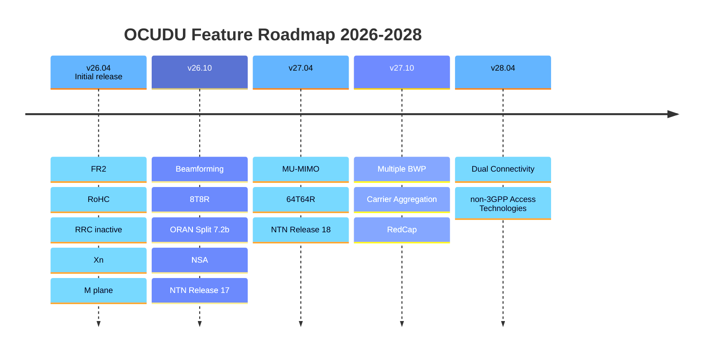

import DocCard from '@theme/DocCard';

# Releases

Development status, current features, and release roadmap for OCUDU. New versions ship every April and October.

  <DocCard item={{type: 'link', href: '/releases/release_notes', label: 'Release Notes', description: 'Per-release changelog covering new features, protocol updates, and fixes for all OCUDU versions.'}} />

## Development Status

  

    

      
Apr 2026

      
First Release

      
v26.04 · initial public release

    

  

  

    

      
Active

      
OCUDU gNB

      
CU-CP · CU-UP · DU

    

  

  

    

      
Active

      
OCUDU gNB

      
O1 agent · E2 agent

    

  

## Current Features

  

    <h4>Radio &amp; Physical Layer</h4>
    <ul>
      <li>FDD/TDD, all FR1 and FR2 bands</li>
      <li>All bandwidths up to 100 MHz (FR1) and 400 MHz (FR2)</li>
      <li>15, 30, and 120 kHz subcarrier spacing</li>
      <li>All physical channels</li>
      <li>QAM-256, 4x4 MIMO DL and UL</li>
      <li>Optimised LDPC/Polar codecs for ARM Neon and x86 AVX2/AVX512</li>
      <li>SSB-based and CSI-RS-based radio link monitoring</li>
      <li>NTN GEO support</li>
    </ul>
  

  

    <h4>Protocol Stack</h4>
    <ul>
      <li>All RRC and MAC procedures</li>
      <li>All handover and mobility types over NG and Xn (including Conditional HO)</li>
      <li>Robust Header Compression (RoHC)</li>
      <li>RRC_INACTIVE support</li>
      <li>NRPPa using RSRP and SRS</li>
      <li>RAN slicing</li>
    </ul>
  

  

    <h4>Architecture &amp; Deployment</h4>
    <ul>
      <li>CU/DU and CU-CP/CU-UP separation</li>
      <li>Split 7.2 via Open Fronthaul library</li>
      <li>M-plane support via OCUDU helper components</li>
      <li>Hardware accelerator support via DPDK BBDEV</li>
    </ul>
  

## Roadmap

Planned features by release, through the end of the programme in October 2028.

