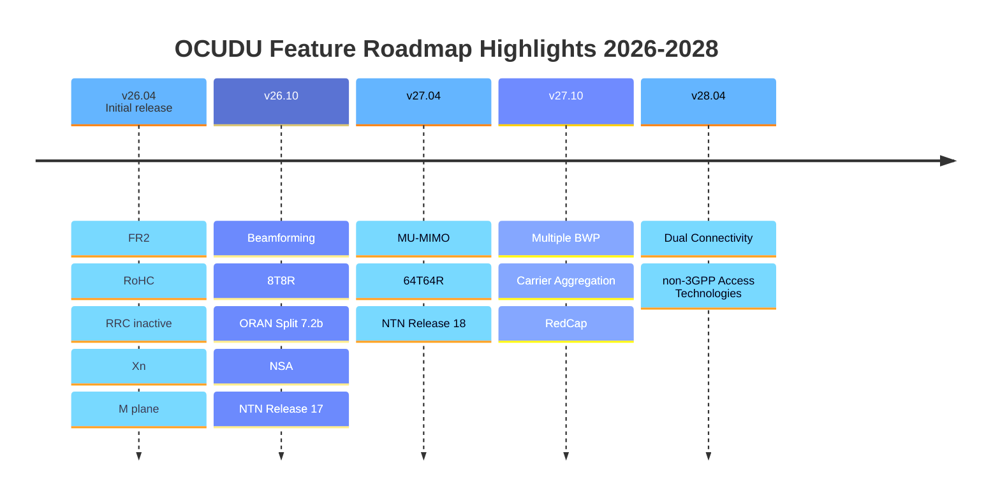

# Features and Roadmap

OCUDU is an open-source initiative that has been awarded initial funding by the National Spectrum Consortium (NSC) under a three-year program running through October 2028.
See [here](https://www.nationalspectrumconsortium.org/news-detail/ocudu-awardees-deepsig-srs)
for more details.

The project follows a clearly defined development roadmap covering the full period of performance.
The first public release is scheduled for April 2026. Beginning with that release, we will adopt a
predictable bi-annual release cycle, issuing new versions every April and October to ensure steady
feature development, community feedback integration, and long-term sustainability.

  

    

      
Apr 2026

      
First Release

      
v26.04 · initial public release

    

  

  

    

      
Active

      
OCUDU gNB

      
CU-CP · CU-UP · DU

    

  

  

    

      
Bi-annual

      
Release Cycle

      
April and October each year

    

  

## Current Features

  

    <h4>Radio &amp; Physical Layer</h4>
    <ul>
      <li>FDD/TDD, all FR1 and FR2 bands</li>
      <li>All bandwidths up to 100 MHz (FR1) and 400 MHz (FR2)</li>
      <li>15, 30, and 120 kHz subcarrier spacing</li>
      <li>All physical channels</li>
      <li>QAM-256, 4x4 MIMO DL and UL</li>
      <li>Optimised LDPC/Polar codecs for ARM Neon and x86 AVX2/AVX512</li>
      <li>SSB-based and CSI-RS-based radio link monitoring</li>
      <li>NTN GEO support</li>
    </ul>
  

  

    <h4>Protocol Stack</h4>
    <ul>
      <li>All RRC and MAC procedures</li>
      <li>All handover and mobility types over NG and Xn (including Conditional HO)</li>
      <li>Robust Header Compression (RoHC)</li>
      <li>RRC_INACTIVE support</li>
      <li>NRPPa using RSRP and SRS</li>
      <li>RAN slicing</li>
    </ul>
  

  

    <h4>Architecture &amp; Deployment</h4>
    <ul>
      <li>CU/DU and CU-CP/CU-UP separation</li>
      <li>Split 7.2a via in-house Open Fronthaul library</li>
      <li>M-plane support via OCUDU helper components</li>
      <li>Hardware accelerator support via DPDK BBDEV</li>
    </ul>
  

## Roadmap

The roadmap items listed below are currently planned with allocated engineering resources and a defined delivery timeline. However, this roadmap is not fixed. With additional engineering capacity
and collaborative contributions, priorities and timelines can be adjusted. If there are features within the OCUDU scope that are not currently listed but are important to you or your organization, we welcome discussions on accelerating, expanding, or (re-)prioritizing development through resource support and joint contribution.

### Coming in 26.10

* Beamforming
* 8T8R
* NR Positioning: Angle-based and DL-PRS
* ORAN Split 7.2b support
* 2-step RACH
* Enhanced fault-tolerance and resilience
* NTN Release 17

### Coming in 27.04

* MU-MIMO, 16 DL / 8 UL layers 
* Up to 64T64R
* Reciprocity-based Beamforming
* SRS Antenna Switching
* EPS Fallback
* NTN Release 18

### Coming in 27.10

* Multiple BWP
* Carrier Aggregation up to 8 CC DL and 4 CC UL
* Emergency Call Priorization 
* SRS Coverage Enhancements
* Release 17 Type-II codebook Enhancements
* RedCap

### Coming in 28.04

* Dual Connectivity
* UL Tx switching
* S-NPN and NPI-NPN
* Support for non-3GPP Access Technologies
* Non-standalone (NSA) with third-party eNodeB

### Coming in 28.10

* Final optimizations and refinements
* Preparations for final External Test and Validation
