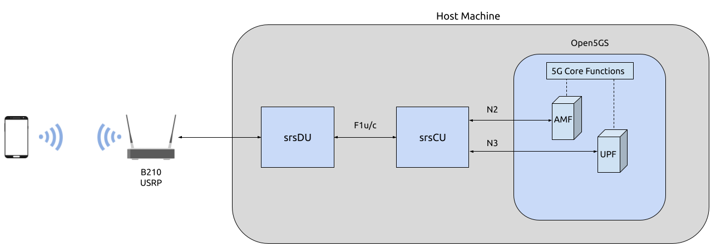

# O-RAN CU-DU Split

## Overview

This tutorial outlines the steps required to configure and run the O-DU and O-CU applications, to create an E2E O-RAN compliant network with a CU-DU split. In this tutorial a USRP is used as the RF-frontend, resulting in this
being a [Split 8](https://www.rcrwireless.com/20210317/5g/exploring-functional-splits-in-5g-ran-tradeoffs-and-use-cases-reader-forum#:~:text=Split%208%3A%20PHY%2DRF%20split.%C2%A0) configuration.
To implement a Split 7.2x configuration, use this guide in conjunction with the [RU Guide](../oranru/index.md).



---

## Hardware and Software Overview

For this application note, the following hardware and software are used:

- PC with, e.g. Ubuntu 24.04 LTS
- [OCUDU](https://gitlab.com/ocudu/ocudu.git)
- [Ettus Research B210 USRP](https://www.ettus.com/all-products/ub210-kit/) (connected over USB 3.0)
- [Open5GS 5G Core](https://open5gs.org/) (running bare metal)
- COTS UE (Xiaomi 12 5G)

### OCUDU

If you have not already done so, install the latest version of OCUDU and all of its dependencies. This is outlined in the [Installation Guide](../../user_manual/installation/installation.md).

### B210

This example uses a USRP B210, it must be connected to the PC via USB 3.0. The use of an external clock is not compulsory, but for setups where the connection is unstable or the UE struggles to connect it is recommended.

### Open5GS

For this example, Open5GS is running bare metal on the host machine.

Open5GS is a C-language Open Source implementation for 5G Core and EPC. The following links will provide you
with the information needed to download and set-up Open5GS so that it is ready to use with OCUDU:

- [GitHub](https://github.com/open5gs/open5gs)
- [Quickstart Guide](https://open5gs.org/open5gs/docs/guide/01-quickstart/)

### COTS UE

A 5G SA capable COTS UE is used for this tutorial, specifically the [Xiaomi 12 5G](https://www.mi.com/es/product/xiaomi-12/specs/). A detailed list of COTS UEs that have been tested with OCUDU can be found [here](../../knowledge_base/cots_ues/index.md).

For more information on connecting a COTS UEs to OCUDU, see the [full tutorial](../cots_ue/index.md).

---

## Configuration

For the CU-DU split two configuration files are needed, one for CU and one for DU. These configuration files are explained in detail [here](../../user_manual/config_reference/config_reference.mdx).

### Core

As previously stated, Open5GS is running bare metal for this example. No configuration changes are needed, simply register the credentials of the UE being used if you haven’t done so already. The Quickstart Guide linked above outlines how to configure the core.

### OCUDU CU

To configure the CU, the `amf`, `f1ap` and `f1u` fields must be configured correctly in both the `cu_cp` and `cu_up`. The following configuration file shows the minimum requirements to configure srsCU:

```yaml
cu_cp:
  amf:
    addr: 127.0.1.100                     # The address or hostname of the AMF.
    bind_addr: 127.0.1.1                  # A local IP that the gNB binds to for traffic from the AMF.
    supported_tracking_areas:             # Configure the TA associated with the CU-CP
      - tac: 7
        plmn_list:
          - plmn: "00101"
            tai_slice_support_list:
              - sst: 1
  f1ap:
    bind_addr: 127.0.10.1                 # Configure the F1AP bind address, this will enable the CU-cp to connect to the DU

cu_up:
  f1u:
    socket:                               # Define UDP/IP socket(s) for F1-U interface.
      -                                     # Socket 1
        bind_addr: 127.0.10.1                  # Sets the address that the F1-U socket will bind to.
```

The `amf` parameters are specific to the local configuration of the core. If you are running Open5GS via the docker scripts provided with OCUDU, your configuration will be different. The same is true if you have
made any other local changes to how Open5GS has been configured.

### OCUDU DU

To configure the DU, the `f1ap` and `f1u` parameters must be configured, as well as the `ru_sdr` and `cell_cfg` parameters. As with srsCU, the following are the minimum requirements to configure srsDU:

```yaml
f1ap:
  cu_cp_addr: 127.0.10.1                    # The address of CU-CP
  bind_addr: 127.0.1.2             

f1u:
  socket:
    -
      bind_addr: 127.0.1.2

ru_sdr:
  device_driver: uhd
  device_args: type=b200,num_recv_frames=64,num_send_frames=64
  srate: 23.04
  otw_format: sc12
  tx_gain: 80
  rx_gain: 40

cell_cfg:
  dl_arfcn: 650000
  band: 78
  channel_bandwidth_MHz: 20
  common_scs: 30
  plmn: "00101"
  tac: 7
  pci: 1
```

In this example, the DU is configured to work with a USRP B210, and to create a 20 MHz cell. The specifics of the RU being used and the desired cell can be changed as needed. The `f1ap` configuration must remain constant with the associated configuration in the CU.

---

## Running the Network

The following running order must be followed to correctly initialize the network:

1. Open5GS
2. OCUDU CU
3. OCUDU DU

### Core

If the Open5GS documentation has been followed correctly, then the core should already be running as a service in the background. If not, then start the core according to the steps in the Open5GS docs.

### OCUDU CU

First, navigate to the CU application folder. This can be done with the following command:

```bash
cd ~/ocudu/build/apps/ocu
```

To run the CU the following command can be used (assuming the configuration file is also located in the same folder):

```bash
sudo ./ocu -c cu.yml
```

If the CU is running correctly, you should see the following in the console:

```bash
--== OCUDU CU (commit 2be82d8ea3) ==--

N2: Connection to AMF on 127.0.1.100:38412 completed
F1-C: Listening for new connections on 127.0.10.1:38472...
==== CU started ===
Type <h> to view help
```

### OCUDU DU

The DU is run in the same way as the CU.

First, navigate to the correct folder:

```bash
cd ~/ocudu/build/apps/du
```

The DU can be run with the following command (assuming the configuration file is also located in the same folder):

```bash
sudo ./odu -c du.yml
```

If the DU is running correctly, you will see the following in the console:

```bash
--== OCUDU DU (commit 2be82d8ea3) ==--

Lower PHY in quad executor mode.
Available radio types: uhd.
[INFO] [UHD] linux; GNU C++ version 11.4.0; Boost_107400; DPDK_23.11; UHD_4.8.0.0-64-g0dede88c
[INFO] [LOGGING] Fastpath logging disabled at runtime.
Making USRP object with args 'type=b200,num_recv_frames=64,num_send_frames=64'
[INFO] [B200] Detected Device: B200mini
[INFO] [B200] Operating over USB 3.
[INFO] [B200] Initialize CODEC control...
[INFO] [B200] Initialize Radio control...
[INFO] [B200] Performing register loopback test...
[INFO] [B200] Register loopback test passed
[INFO] [B200] Setting master clock rate selection to 'automatic'.
[INFO] [B200] Asking for clock rate 16.000000 MHz...
[INFO] [B200] Actually got clock rate 16.000000 MHz.
[INFO] [MULTI_USRP] Setting master clock rate selection to 'manual'.
[INFO] [B200] Asking for clock rate 23.040000 MHz...
[INFO] [B200] Actually got clock rate 23.040000 MHz.
Cell pci=1, bw=20 MHz, 1T1R, dl_arfcn=650000 (n78), dl_freq=3750 MHz, dl_ssb_arfcn=649632, ul_freq=3750 MHz

F1-C: Connection to CU-CP on 127.0.10.1:38472 completed
==== DU started ===
Type <h> to view help
```

---

## Connecting to the Network

Connecting the COTS UE to the network follows the same steps outlined in [this tutorial](../cots_ue/index.md). 

### Console Outputs

The CU console will not display any further automatic outputs once the UE is connected; however, the usual trace and outputs associated with the “vanilla” gNB output can we seen in the DU console.

Typing `t` on the DU console will result in something similar to the following output once the UE has connected:

```bash
         |--------------------DL---------------------|-------------------------UL------------------------------
pci rnti | cqi  ri  mcs  brate   ok  nok  (%)  dl_bs | pusch  rsrp  mcs  brate   ok  nok  (%)    bsr     ta  phr
  1 4601 |  15 1.0   21   9.2k   11    1   8%      0 |  24.2   ovl   26    33k    8    0   0%      0   -81n    0
  1 4601 |  15 1.0   27   429k   84    0   0%      0 |  31.6 -11.5   28   221k   25    0   0%      0      0    7
  1 4601 |  15 1.0   27   686k  119    0   0%      0 |  32.7 -12.4   28   236k   44    0   0%      0   -56n   17
  1 4601 |  15 1.0   27   664k  110    0   0%      0 |  32.1 -12.8   28   353k   46    0   0%     10   -32n   16
  1 4601 |  15 1.0   27   517k   64    0   0%      0 |  33.6 -12.3   28   124k   29    0   0%    198   -40n   17
  1 4601 |  15 1.0   27    60k   36    0   0%      0 |  33.0 -11.8   28   127k   21    0   0%      0   -24n   17
```