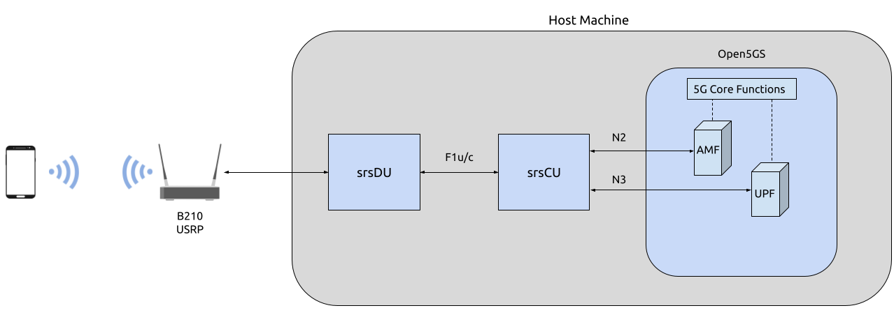

import Tabs from '@theme/Tabs';
import TabItem from '@theme/TabItem';

# Deploying a CU/DU split over F1

## Overview

This tutorial outlines the steps required to configure and run the O-DU and O-CU applications to create an E2E O-RAN compliant network with a CU-DU split. Two setups are shown: an over-the-air setup using a USRP as the RF frontend, and a ZeroMQ-based setup for testing without physical radio hardware.

The over-the-air setup uses a USRP, resulting in a [Split 8](https://www.rcrwireless.com/20210317/5g/exploring-functional-splits-in-5g-ran-tradeoffs-and-use-cases-reader-forum#:~:text=Split%208%3A%20PHY%2DRF%20split.%C2%A0) configuration. To implement a Split 7.2x configuration, use this guide in conjunction with the [RU Guide](../oranru/index.md).

---

## Hardware and Software Overview

For this tutorial, the following hardware and software are used:

- PC with, e.g. Ubuntu 24.04 LTS
- [OCUDU](https://gitlab.com/ocudu/ocudu.git)
- [srsRAN 4G](https://github.com/srsran/srsRAN_4G) (23.11 or later)
- [Ettus Research B210 USRP](https://www.ettus.com/all-products/ub210-kit/) (connected over USB 3.0)
- [Open5GS 5G Core](https://open5gs.org/) (running bare metal)
- COTS UE (Xiaomi 12 5G)
- [ZeroMQ](https://zeromq.org/)

### OCUDU

If you have not already done so, install the latest version of OCUDU and all of its dependencies. This is outlined in the [Installation Guide](../../user_manual/installation/installation.md).

### B210

This example uses a USRP B210, it must be connected to the PC via USB 3.0. The use of an external clock is not compulsory, but for setups where the connection is unstable or the UE struggles to connect it is recommended.

### Open5GS

For this example, Open5GS is running bare metal on the host machine.

Open5GS is a C-language Open Source implementation for 5G Core and EPC. The following links will provide you
with the information needed to download and set-up Open5GS so that it is ready to use with OCUDU:

- [GitHub](https://github.com/open5gs/open5gs)
- [Quickstart Guide](https://open5gs.org/open5gs/docs/guide/01-quickstart/)

### COTS UE

A 5G SA capable COTS UE is used for this tutorial, specifically the [Xiaomi 12 5G](https://www.mi.com/es/product/xiaomi-12/specs/). A detailed list of COTS UEs that have been tested with OCUDU can be found [here](../../knowledge_base/cots_ues/index.md).

For more information on connecting a COTS UEs to OCUDU, see the [full tutorial](../cots_ue/index.md).

---

## Setup

This tutorial covers two setups: an over-the-air setup using a USRP, and a ZeroMQ-based setup using srsUE as a simulated UE. Select the tab below that matches your setup, then follow that tab through Configuration, Running the Network, and Connecting to the Network.

<Tabs groupId="cu-du-setup">
  <TabItem value="ota" label="Over-the-air (USRP)" default>



### Configuration

For the CU-DU split two configuration files are needed, one for CU and one for DU. These configuration files are explained in detail [here](../../user_manual/config_reference/config_reference.mdx).

#### Core

As previously stated, Open5GS is running bare metal for this example. No configuration changes are needed, simply register the credentials of the UE being used if you haven’t done so already. The Quickstart Guide linked above outlines how to configure the core.

#### OCUDU CU

To configure the CU, the `amf`, `f1ap` and `f1u` fields must be configured correctly in both the `cu_cp` and `cu_up`. The following configuration file shows the minimum requirements to configure srsCU:

```yaml
cu_cp:
  amf:
    addr: 127.0.1.100                     # The address or hostname of the AMF.
    bind_addr: 127.0.1.1                  # A local IP that the gNB binds to for traffic from the AMF.
    supported_tracking_areas:             # Configure the TA associated with the CU-CP
      - tac: 7
        plmn_list:
          - plmn: "00101"
            tai_slice_support_list:
              - sst: 1
  f1ap:
    bind_addr: 127.0.10.1                 # Configure the F1AP bind address, this will enable the CU-cp to connect to the DU

cu_up:
  f1u:
    socket:                               # Define UDP/IP socket(s) for F1-U interface.
      -                                     # Socket 1
        bind_addr: 127.0.10.1                  # Sets the address that the F1-U socket will bind to.
```

The `amf` parameters are specific to the local configuration of the core. If you are running Open5GS via the docker scripts provided with OCUDU, your configuration will be different. The same is true if you have
made any other local changes to how Open5GS has been configured.

#### OCUDU DU

To configure the DU, the `f1ap` and `f1u` parameters must be configured, as well as the `ru_sdr` and `cell_cfg` parameters. As with srsCU, the following are the minimum requirements to configure srsDU:

```yaml
f1ap:
  cu_cp_addr: 127.0.10.1                    # The address of CU-CP
  bind_addr: 127.0.1.2             

f1u:
  socket:
    -
      bind_addr: 127.0.1.2

ru_sdr:
  device_driver: uhd
  device_args: type=b200,num_recv_frames=64,num_send_frames=64
  srate: 23.04
  otw_format: sc12
  tx_gain: 80
  rx_gain: 40

cell_cfg:
  dl_arfcn: 650000
  band: 78
  channel_bandwidth_MHz: 20
  common_scs: 30
  plmn: "00101"
  tac: 7
  pci: 1
```

In this example, the DU is configured to work with a USRP B210, and to create a 20 MHz cell. The specifics of the RU being used and the desired cell can be changed as needed. The `f1ap` configuration must remain constant with the associated configuration in the CU.

---

### Running the Network

The following running order must be followed to correctly initialize the network:

1. Open5GS
2. OCUDU CU
3. OCUDU DU

#### Core

If the Open5GS documentation has been followed correctly, then the core should already be running as a service in the background. If not, then start the core according to the steps in the Open5GS docs.

#### OCUDU CU

First, navigate to the CU application folder. This can be done with the following command:

```bash
cd ~/ocudu/build/apps/ocu
```

To run the CU the following command can be used (assuming the configuration file is also located in the same folder):

```bash
sudo ./ocu -c cu.yml
```

If the CU is running correctly, you should see the following in the console:

```bash
--== OCUDU CU (commit 2be82d8ea3) ==--

N2: Connection to AMF on 127.0.1.100:38412 completed
F1-C: Listening for new connections on 127.0.10.1:38472...
==== CU started ===
Type <h> to view help
```

#### OCUDU DU

The DU is run in the same way as the CU.

First, navigate to the correct folder:

```bash
cd ~/ocudu/build/apps/du
```

The DU can be run with the following command (assuming the configuration file is also located in the same folder):

```bash
sudo ./odu -c du.yml
```

If the DU is running correctly, you will see the following in the console:

```bash
--== OCUDU DU (commit 2be82d8ea3) ==--

Lower PHY in quad executor mode.
Available radio types: uhd.
[INFO] [UHD] linux; GNU C++ version 11.4.0; Boost_107400; DPDK_23.11; UHD_4.8.0.0-64-g0dede88c
[INFO] [LOGGING] Fastpath logging disabled at runtime.
Making USRP object with args 'type=b200,num_recv_frames=64,num_send_frames=64'
[INFO] [B200] Detected Device: B200mini
[INFO] [B200] Operating over USB 3.
[INFO] [B200] Initialize CODEC control...
[INFO] [B200] Initialize Radio control...
[INFO] [B200] Performing register loopback test...
[INFO] [B200] Register loopback test passed
[INFO] [B200] Setting master clock rate selection to 'automatic'.
[INFO] [B200] Asking for clock rate 16.000000 MHz...
[INFO] [B200] Actually got clock rate 16.000000 MHz.
[INFO] [MULTI_USRP] Setting master clock rate selection to 'manual'.
[INFO] [B200] Asking for clock rate 23.040000 MHz...
[INFO] [B200] Actually got clock rate 23.040000 MHz.
Cell pci=1, bw=20 MHz, 1T1R, dl_arfcn=650000 (n78), dl_freq=3750 MHz, dl_ssb_arfcn=649632, ul_freq=3750 MHz

F1-C: Connection to CU-CP on 127.0.10.1:38472 completed
==== DU started ===
Type <h> to view help
```

---

### Connecting to the Network

Connecting the COTS UE to the network follows the same steps outlined in [this tutorial](../cots_ue/index.md).

#### Console Outputs

The CU console will not display any further automatic outputs once the UE is connected; however, the usual trace and outputs associated with the “vanilla” gNB output can be seen in the DU console.

Typing `t` on the DU console will result in something similar to the following output once the UE has connected:

```bash
         |--------------------DL---------------------|-------------------------UL------------------------------
pci rnti | cqi  ri  mcs  brate   ok  nok  (%)  dl_bs | pusch  rsrp  mcs  brate   ok  nok  (%)    bsr     ta  phr
  1 4601 |  15 1.0   21   9.2k   11    1   8%      0 |  24.2   ovl   26    33k    8    0   0%      0   -81n    0
  1 4601 |  15 1.0   27   429k   84    0   0%      0 |  31.6 -11.5   28   221k   25    0   0%      0      0    7
  1 4601 |  15 1.0   27   686k  119    0   0%      0 |  32.7 -12.4   28   236k   44    0   0%      0   -56n   17
  1 4601 |  15 1.0   27   664k  110    0   0%      0 |  32.1 -12.8   28   353k   46    0   0%     10   -32n   16
  1 4601 |  15 1.0   27   517k   64    0   0%      0 |  33.6 -12.3   28   124k   29    0   0%    198   -40n   17
  1 4601 |  15 1.0   27    60k   36    0   0%      0 |  33.0 -11.8   28   127k   21    0   0%      0   -24n   17
```

  </TabItem>
  <TabItem value="zmq" label="ZeroMQ">

### Configuration

This setup requires [srsRAN 4G](https://github.com/srsran/srsRAN_4G) (23.11 or later) and [ZeroMQ](https://zeromq.org/) in addition to OCUDU and Open5GS. For installation guides, see the [Installation Guide](../../user_manual/installation/installation.md) and the [srsRAN 4G ZeroMQ Application Note](https://docs.srsran.com/projects/4g/en/latest/app_notes/source/zeromq/source/index.html).

Download the example configuration files for this setup:

- [CU ZMQ config](assets/cu_zmq.yml)
- [DU ZMQ config](assets/du_zmq.yml)

#### OCUDU CU

The CU configuration for ZMQ mode uses the same F1AP setup as the RF setup. Update the `amf` addresses to match your core network:

```yaml
cu_cp:
  amf:
    addrs: 10.53.1.2
    bind_addrs: 10.53.1.1
    supported_tracking_areas:
      - tac: 7
        plmn_list:
          - plmn: "00101"
            tai_slice_support_list:
              - sst: 1
  f1ap:
    bind_addrs: 127.0.10.1

cu_up:
  f1u:
    socket:
      - bind_addr: 127.0.10.1
```

#### OCUDU DU

The DU configuration sets `device_driver` to `zmq` and specifies ZMQ socket addresses for the virtual RF link. The cell uses FDD Band 3 with 10 MHz bandwidth and 15 kHz SCS to match srsUE capabilities. The `pdcch`, `prach`, `pdsch` and `pusch` fields under `cell_cfg` are also required, as srsUE expects specific search space and PRACH settings that differ from the OTA defaults:

```yaml
f1ap:
  addrs: 127.0.10.1                # Address of the CU-CP's F1AP endpoint
  bind_addrs: 127.0.10.2           # Local address the DU binds to for the F1AP connection

f1u:
  socket:
    - bind_addr: 127.0.10.2        # Local address the DU binds to for the F1-U connection

ru_sdr:
  device_driver: zmq                                                                          # Use ZeroMQ as a virtual RF frontend instead of a physical radio
  device_args: tx_port=tcp://127.0.0.1:2000,rx_port=tcp://127.0.0.1:2001,base_srate=11.52e6    # DU tx_port and rx_port; tx_port must match srsUE's rx_port, and rx_port must match srsUE's tx_port
  srate: 11.52                     # Sample rate in MHz, must match base_srate above
  tx_gain: 0                       # Gain is not used in ZMQ mode
  rx_gain: 0                       # Gain is not used in ZMQ mode

cell_cfg:
  dl_arfcn: 368500                 # DL ARFCN corresponding to band 3
  band: 3                          # FDD band 3, set to match srsUE capabilities
  channel_bandwidth_MHz: 10        # 10 MHz cell bandwidth, set to match srsUE capabilities
  common_scs: 15                   # 15 kHz subcarrier spacing, set to match srsUE capabilities
  plmn: "00101"                    # PLMN, must match the core network and UE subscriber configuration
  tac: 7                           # Tracking area code, must match the CU-CP configuration
  pdcch:
    common:
      ss0_index: 0                  # Set search space zero index to match srsUE capabilities
      coreset0_index: 6             # Set search CORESET Zero index to match srsUE capabilities
    dedicated:
      ss2_type: common              # Search Space type, has to be set to common
      dci_format_0_1_and_1_1: false # Set correct DCI format (fallback)
  prach:
    prach_config_index: 1           # Sets PRACH config to match what is expected by srsUE
    total_nof_ra_preambles: 64      # Sets number of available PRACH preambles
    nof_ssb_per_ro: 1               # Sets the number of SSBs per RACH occasion.
    nof_cb_preambles_per_ssb: 64    # Sets the number of contention based preambles per SSB.
  pdsch:
    mcs_table: qam64                # Sets PDSCH MCS to 64 QAM
  pusch:
    mcs_table: qam64                # Sets PUSCH MCS to 64 QAM
```

This is the same configuration as [`du_zmq.yml`](assets/du_zmq.yml), included here in full so it can be copied directly without needing to download the file.

---

### Running the Network

Start the components in the following order:

1. Open5GS
2. OCUDU CU
3. OCUDU DU
4. srsUE

Start the CU using the ZMQ configuration file:

```bash
cd ~/ocudu/build/apps/ocu
sudo ./ocu -c cu_zmq.yml
```

If the CU is running correctly, you should see the following in the console:

```bash
--== OCUDU CU (commit 5c35f7cef2) ==--

N2: Connection to AMF on 10.53.1.2:38412 completed
F1-C: Listening for new connections on bind addresses 127.0.10.1, port 38472...
==== CU started ===
Type <h> to view help
```

Start the DU using the ZMQ configuration file:

```bash
cd ~/ocudu/build/apps/du
sudo ./odu -c du_zmq.yml
```

If the DU is running correctly, you will see the following in the console:

```bash
--== OCUDU DU (commit 5c35f7cef2) ==--

Lower PHY in executor sequential baseband mode.
Available radio types: zmq and realtime_loopback.
Cell pci=1, bw=10 MHz, 1T1R, dl_arfcn=368500 (n3), dl_freq=1842.5 MHz, dl_ssb_arfcn=368410, ul_freq=1747.5 MHz

F1-C: Connection to CU-CP on 127.0.10.1:38472 completed
==== DU started ===
Type <h> to view help
```

The DU will wait for a ZMQ connection before completing startup. Start srsUE after the DU is running.

The DU and srsUE ZMQ ports must be paired in opposite directions. The DU's `tx_port` is the port srsUE receives on. The DU's `rx_port` is the port srsUE transmits on. Using the ports from the DU config above, `tx_port=tcp://127.0.0.1:2000` and `rx_port=tcp://127.0.0.1:2001`, configure srsUE with `rx_port=tcp://127.0.0.1:2000` and `tx_port=tcp://127.0.0.1:2001`. If the ports are not swapped this way, the DU and srsUE cannot exchange baseband samples.

---

### Connecting to the Network

For srsUE configuration and the steps to connect it to the ZMQ DU, see the [srsUE tutorial](../srsue/index.md).

#### Console Outputs

Once srsUE is started, it attaches to the network over the ZMQ link and the following is shown in the srsUE console:

```bash
Opening 1 channels in RF device=zmq with args=tx_port=tcp://127.0.0.1:2001,rx_port=tcp://127.0.0.1:2000,base_srate=11.52e6
Supported RF device list: zmq file
CHx base_srate=11.52e6
Current sample rate is 1.92 MHz with a base rate of 11.52 MHz (x6 decimation)
CH0 rx_port=tcp://127.0.0.1:2000
CH0 tx_port=tcp://127.0.0.1:2001
Current sample rate is 11.52 MHz with a base rate of 11.52 MHz (x1 decimation)
Current sample rate is 11.52 MHz with a base rate of 11.52 MHz (x1 decimation)
Waiting PHY to initialize ... done!
Attaching UE...
Random Access Transmission: prach_occasion=0, preamble_index=0, ra-rnti=0x39, tti=174
Random Access Complete.     c-rnti=0x4601, ta=0
RRC Connected
PDU Session Establishment successful. IP: 10.45.1.2
RRC NR reconfiguration successful.
```

Note that srsUE's `rx_port` matches the DU's `tx_port`. srsUE's `tx_port` matches the DU's `rx_port`. This pairing is described under Running the Network above.

  </TabItem>
</Tabs>

---

## Troubleshooting

### CU and DU not connecting

If the DU fails to establish an F1AP connection to the CU, the DU console will not print `F1-C: Connection to CU-CP on ... completed`. The DU will also not proceed past cell configuration. Check the following:

- The `f1ap.cu_cp_addr` (OTA) or `f1ap.addrs` (ZMQ) value in the DU config must exactly match the `f1ap.bind_addr` (OTA) or `f1ap.bind_addrs` (ZMQ) value in the CU config.
- Start the CU before the DU. The DU retries the F1AP connection. It does not proceed with startup until it connects to the CU.
- Confirm that no firewall rule or other process on the host is blocking the configured F1AP port. Check with `sudo netstat -tulnp | grep <port>`, for example.
- If the CU and DU run on separate hosts, confirm the bind and target addresses reflect their actual reachable IP addresses. Do not reuse the loopback addresses from the single-host examples above.

### DU and srsUE not exchanging samples (ZeroMQ setup)

If srsUE cannot detect the cell, or the DU repeatedly logs errors related to samples or timeouts, suspect a ZMQ port mismatch:

- Confirm the DU's `tx_port` matches srsUE's `rx_port`. Confirm the DU's `rx_port` matches srsUE's `tx_port`, as described under Running the Network in the ZeroMQ tab above. Forgetting to swap the ports between the DU and srsUE configs is the most common cause of this issue.
- Confirm `base_srate` in the DU config matches the corresponding sample rate in the srsUE config; a mismatch produces synchronization errors.
- Make sure only one instance of the DU or srsUE is running. A leftover process can hold a ZMQ port open. This blocks a new instance from binding to it.

### UE does not connect to the core

If the UE reaches the DU without registering with the core, check the following:

- Confirm the UE's subscriber credentials exist in the Open5GS subscriber database.
- Confirm the `plmn` and `tac` values in the DU config match the tracking area configured in the CU-CP and in Open5GS.

See the [Troubleshooting guide](../../user_manual/troubleshooting/troubleshooting.md) for further steps at the core network level.

---

## Next steps

- [Connecting an O-RAN RU](../oranru/index.md) — connect an O-RAN 7.2 radio unit.
- [Integrating a Near-RT RIC](../near-rt-ric/index.md) — add the E2 interface and deploy an xApp.
- [Running on Kubernetes](../k8s/index.md) — deploy the components as Kubernetes pods.
