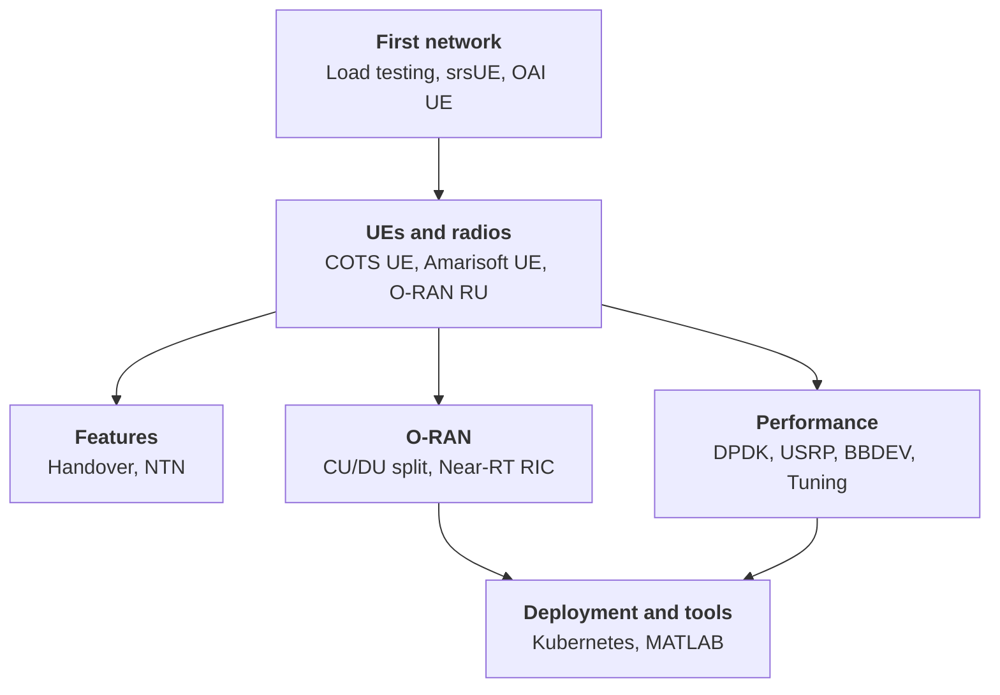

import DocCard from '@theme/DocCard';

# Tutorials

Step-by-step guides from your first gNB to advanced multi-component deployments. Each tutorial has a single goal: follow it in order and you will have a working system by the end.

The groups below run roughly from least to most infrastructure. Pick the group that matches what you want to do.

:::tip New to OCUDU? Follow this path
1. [Load testing](./testmode/index.md): validate your build, no radio hardware needed.
2. [Using srsUE](./srsue/index.md): add a software UE over ZeroMQ.
3. [Connecting a COTS UE](./cots_ue/index.md): move to a real device with a USRP.
:::

:::tip Coming from srsRAN Project?
See the [Migration Guide](/migration/) for instructions on porting your existing srsRAN Project modifications to OCUDU.
:::

## How the tutorials fit together

Start with a first network, then branch into whichever direction fits your goal.

## First network

No RF hardware required. Validate your build, then bring up a complete software network over ZeroMQ.

<section className="row">
  <article className="col col--6 margin-bottom--lg">
    <DocCard item={{type: 'link', href: '/tutorials/testmode/', label: 'Load testing', description: 'Verify your OCUDU installation and explore the configuration without radio hardware or a physical UE.'}} />
  </article>
  <article className="col col--6 margin-bottom--lg">
    <DocCard item={{type: 'link', href: '/tutorials/srsue/', label: 'Using srsUE', description: 'Build a complete open-source split 8 5G network using srsUE as the UE and Open5GS as the core.'}} />
  </article>
  <article className="col col--6 margin-bottom--lg">
    <DocCard item={{type: 'link', href: '/tutorials/oaiue/', label: 'Using the OAI UE', description: 'Build an end-to-end open-source 5G TDD network using the OpenAirInterface UE over ZeroMQ, with an OCUDU gNB and Open5GS core.'}} />
  </article>
</section>

## UEs and radios

Connect a real device, a UE simulator, or an O-RAN radio unit. Requires a USRP RF front-end (or an O-RAN RU for the radio-unit tutorial).

<section className="row">
  <article className="col col--6 margin-bottom--lg">
    <DocCard item={{type: 'link', href: '/tutorials/cots_ue/', label: 'Connecting a COTS UE', description: 'Connect a commercial 5G device to OCUDU using a test SIM and a USRP RF front-end.'}} />
  </article>
  <article className="col col--6 margin-bottom--lg">
    <DocCard item={{type: 'link', href: '/tutorials/amari_ue/', label: 'Connecting an Amarisoft UE', description: 'Connect an Amarisoft UE simulator to OCUDU for multi-UE testing scenarios.'}} />
  </article>
  <article className="col col--6 margin-bottom--lg">
    <DocCard item={{type: 'link', href: '/tutorials/oranru/', label: 'Connecting an O-RAN RU', description: 'Connect an O-RAN-compliant radio unit to OCUDU over the split 7.2 fronthaul interface.'}} />
  </article>
</section>

## O-RAN

Split the stack across O-RAN interfaces and integrate a Near-RT RIC. The CU/DU split runs on any supported RF or test setup; the RIC tutorial requires a Near-RT RIC.

<section className="row">
  <article className="col col--6 margin-bottom--lg">
    <DocCard item={{type: 'link', href: '/tutorials/cu_du_split/', label: 'Splitting CU and DU', description: 'Deploy OCUDU with the CU and DU running as separate processes, connected over the F1 interface.'}} />
  </article>
  <article className="col col--6 margin-bottom--lg">
    <DocCard item={{type: 'link', href: '/tutorials/near-rt-ric/', label: 'Integrating a Near-RT RIC', description: 'Use the E2 interface to integrate OCUDU with a Near-RT RIC and deploy an xApp.'}} />
  </article>
</section>

## Features

Enable and test specific gNB features. Handover needs a COTS UE and a USRP; NTN needs an Amarisoft UE.

<section className="row">
  <article className="col col--6 margin-bottom--lg">
    <DocCard item={{type: 'link', href: '/tutorials/handover/', label: 'Testing handover', description: 'Configure and test intra-gNB handover between two OCUDU cells with a COTS UE.'}} />
  </article>
  <article className="col col--6 margin-bottom--lg">
    <DocCard item={{type: 'link', href: '/tutorials/ntn/', label: 'Enabling NTN', description: 'Enable NTN mode in OCUDU for satellite deployments, covering GEO and LEO scenarios with SIB19 ephemeris and timing support.'}} />
  </article>
</section>

## Performance

Tune throughput and latency with kernel-bypass I/O, hardware offload, and host tuning. Some tutorials need specific hardware: a DPDK-capable NIC, a USRP, or an Intel accelerator.

<section className="row">
  <article className="col col--6 margin-bottom--lg">
    <DocCard item={{type: 'link', href: '/tutorials/dpdk/', label: 'Configuring DPDK', description: 'Configure DPDK kernel-bypass packet I/O for high-throughput Open Fronthaul connectivity with OCUDU.'}} />
  </article>
  <article className="col col--6 margin-bottom--lg">
    <DocCard item={{type: 'link', href: '/tutorials/dpdk_uhd/', label: 'Configuring DPDK with USRP', description: 'Configure DPDK kernel-bypass packet I/O for use with a USRP RF front-end and OCUDU.'}} />
  </article>
  <article className="col col--6 margin-bottom--lg">
    <DocCard item={{type: 'link', href: '/tutorials/accx00/', label: 'Accelerating with BBDEV', description: 'Offload LDPC encoding and decoding to an Intel ACC100 or vRAN Boost (ACC200/VRB1) accelerator via DPDK BBDEV.'}} />
  </article>
  <article className="col col--6 margin-bottom--lg">
    <DocCard item={{type: 'link', href: '/tutorials/tuning/', label: 'Tuning performance', description: 'Tune CPU isolation, IRQ affinity, and kernel settings on a Linux host for real-time OCUDU performance.'}} />
  </article>
</section>

## Deployment and tools

Containerised deployment and supporting tooling. The Kubernetes tutorial needs a cluster.

<section className="row">
  <article className="col col--6 margin-bottom--lg">
    <DocCard item={{type: 'link', href: '/tutorials/k8s/', label: 'Running on Kubernetes', description: 'Deploy OCUDU as Kubernetes pods in a split 7.2 configuration, with containerised CU, DU, and fronthaul components.'}} />
  </article>
  <article className="col col--6 margin-bottom--lg">
    <DocCard item={{type: 'link', href: '/tutorials/matlab/', label: 'Integrating MATLAB', description: 'Integrate MATLAB with OCUDU for signal processing, analysis, and algorithm prototyping.'}} />
  </article>
</section>
