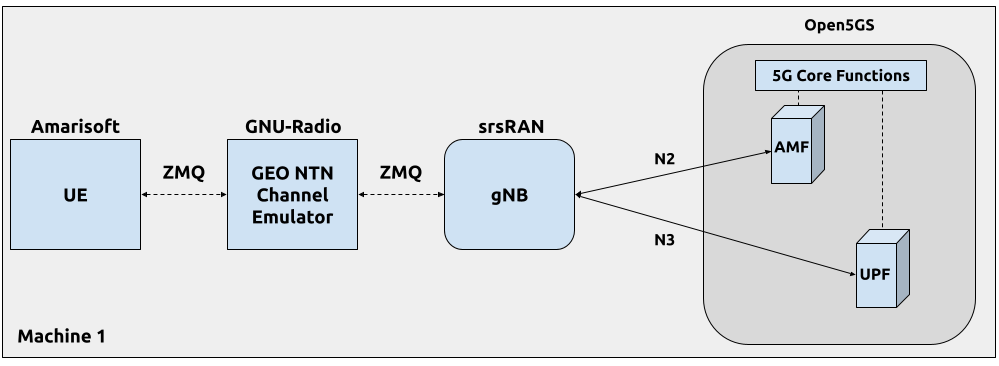
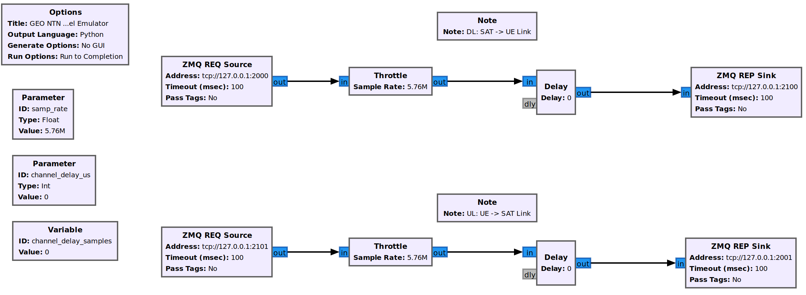

import Tabs from '@theme/Tabs';
import TabItem from '@theme/TabItem';

# OCUDU gNB for 5G NTN

## Overview

This tutorial demonstrates how to configure and run a 5G NR SA Non-Terrestrial Network (NTN) using OCUDU and an Amarisoft UE. NTN is a network deployment where communication between the gNB and UE is relayed via non-terrestrial components, such as satellites.

Deploying NTN introduces unique challenges due to the different link dynamics and characteristics compared to traditional terrestrial networks. To address these challenges, 3GPP introduced several enhancements and features in the 5G NR specifications (Release 17). Key features and enhancements include:

- **Frequency bands and spectrum allocation:** new frequency bands suitable for satellite communication have been standardized to ensure high-capacity links.
- **Timing adjustments and delay management:** mechanisms have been introduced to handle the long and variable propagation delays associated with satellite communication.
- **Doppler shift compensation:** the relative movement of satellites, which can reach speeds of up to 27,000 km/h, introduces non-negligible Doppler shifts that must be compensated for to maintain reliable communication links.

In 3GPP NTN, the UE is responsible for managing long propagation delays and compensating for Doppler frequency shifts. To facilitate this, the gNB broadcasts a new SIB19 block containing NTN-related information, including the current position of the satellite. The UE uses this information to compute the current delay and Doppler frequency and adjust its transmission accordingly.

For more information, you can read the following documents:

- [3GPP TS 38.331 version 17.1.0 Release 17](https://www.etsi.org/deliver/etsi_ts/138300_138399/138331/17.01.00_60/ts_138331v170100p.pdf)
- [3GPP TS 38.300 version 17.1.0 Release 17](https://www.etsi.org/deliver/etsi_ts/138300_138399/138300/17.01.00_60/ts_138300v170100p.pdf)

OCUDU supports GEO, MEO, and LEO NTN scenarios. This tutorial covers GEO and LEO.

## Choosing a path

Both paths use the same Amarisoft UE and Open5GS core, and the steps are almost identical. They differ only in how the satellite channel is emulated: an external GNU Radio emulator, or the Amarisoft UE's built-in NTN channel emulator.

- **External GNU Radio emulator (GEO):** use this for the simplest end-to-end GEO test. An external GNU Radio flowgraph applies a fixed link delay over ZMQ, with static ephemeris. GEO only.
- **Built-in emulator (GEO/LEO):** use this for realistic GEO or LEO passes. The Amarisoft UE's built-in NTN emulator applies the link delay and Doppler internally from a real satellite TLE, and the gNB ephemeris is refreshed live during a LEO pass.

| | External GNU Radio emulator (GEO) | Built-in emulator (GEO/LEO) |
| --- | --- | --- |
| **Best for** | Simplest GEO smoke test | Realistic GEO and LEO passes |
| **Orbits** | GEO | GEO and LEO |
| **Channel effects** | Fixed delay | Variable delay and Doppler |
| **Ephemeris source** | Static, hand-written | Generated from a real TLE |
| **Live SIB19 updates** | Not used | Yes (needed for LEO) |
| **Extra tooling** | GNU Radio Companion | Amarisoft licence for the built-in emulator; Python 3 for the optional helper scripts |

:::tip How to read this guide
Most of this guide is common to both paths. Wherever the paths differ, the section has an **External GNU Radio emulator** and a **Built-in emulator** tab. Picking a tab applies your choice across the whole page, so you only choose once.
:::

## Key concepts

The following parameters appear in the gNB NTN configuration. Each one is documented in full in the [Configuration Reference](../../user_manual/config_reference/config_reference.mdx).

- **Ephemeris:** the satellite position and velocity. OCUDU can broadcast the ephemeris either as an ECEF state vector (`ephemeris_info_ecef`) or as orbital parameters (`ephemeris_orbital`).
- **Epoch time:** the reference time to which the ephemeris and timing parameters apply.
- **Cell-specific k-offset:** a scheduling offset (`cell_specific_koffset`) that accounts for the round-trip time of the NTN link.
- **Timing advance (TA):** NTN separates the common TA (the delay to a reference point) from the UE-specific TA. The TA scheduler is tuned so that a new TA command is not issued before the previous one has been applied by the UE.
- **Feeder link and service link:** the service link connects the UE to the satellite, while the feeder link connects the satellite to the ground gateway. When the gNB is on the ground rather than on the satellite, feeder link Doppler compensation applies.
- **GEO compared with LEO:** a GEO link behaves as a large, effectively constant delay. A LEO satellite moves quickly across the sky, so its delay and Doppler change continuously during a pass and the ephemeris broadcast in SIB19 has to be refreshed while the UE is connected.

---

## Step 1: Prerequisites and installation

### Hardware and software

For this application note, the following hardware and software are used:

- PC with Ubuntu 22.04.1 LTS
- [OCUDU](https://gitlab.com/ocudu/ocudu) (26.04 or later) built with ZeroMQ support
- [Amarisoft UE with NTN support](https://www.amarisoft.com/technology/ue-simulator/) (2023-12-15 or later)
- [Open5GS 5G Core](https://open5gs.org/)
- [Docker](https://docs.docker.com/engine/install/) and Docker Compose, to run the Open5GS core
- [ZeroMQ](https://zeromq.org/)

The Amarisoft UE simulator (AmariUE) is a commercial solution for functional and performance testing of 5G networks; as a compliant LTE, NB-IOT, and NR UE it can simulate multiple UEs concurrently.

Open5GS is an open source 5G Core. This tutorial runs it in Docker using the Compose file in the OCUDU source tree at [`ocudu/docker`](https://gitlab.com/ocudu/ocudu/-/tree/dev/docker) (from the clone in the build step below). The image is already configured for OCUDU, and its subscriber database is pre-populated with the Amarisoft UE test SIM, so it needs no manual setup. It exposes the AMF at `10.53.1.2`, which is the address the gNB connects to in its `cu_cp.amf` section.

### Install ZeroMQ

On Ubuntu, the ZeroMQ development libraries can be installed with:

```bash
sudo apt-get install libzmq3-dev
```

### Build OCUDU

Compile OCUDU with ZeroMQ enabled (assuming the other dependencies are already installed). ZeroMQ is activated by the `-DENABLE_EXPORT=ON -DENABLE_ZEROMQ=ON` flags on the `cmake` command:

```bash
git clone https://gitlab.com/ocudu/ocudu.git
cd ocudu
mkdir build
cd build
cmake ../ -DENABLE_EXPORT=ON -DENABLE_ZEROMQ=ON
make -j`nproc`
```

Pay attention to the cmake console output. Make sure you see the following line:

```default
...
-- FINDING ZEROMQ.
-- Checking for module 'ZeroMQ'
--   No package 'ZeroMQ' found
-- Found libZEROMQ: /usr/local/include, /usr/local/lib/libzmq.so
...
```

:::info
If you built OCUDU before installing ZMQ, you will have to re-build it so the ZMQ drivers are recognized correctly.
:::

### Install the Amarisoft UE and the ZeroMQ TRX driver

Download and install the Amarisoft UE (this tutorial uses version 2023-12-15 or later).

Interfacing the Amarisoft UE with OCUDU requires a custom TRX driver implemented by SRS, found in the OCUDU source at `ocudu/utils/trx_ocudu`. The Amarisoft UE release folder (`amarisoft.2026-03-13.tar.gz`) contains a `trx_uhd-2026-03-13.tar.gz` file; uncompress both before proceeding.

Compile the driver from `ocudu/build`:

```bash
cmake ../ -DENABLE_EXPORT=TRUE -DENABLE_ZEROMQ=TRUE -DENABLE_TRX_DRIVER=TRUE -DTRX_DRIVER_DIR=<PATH TO trx_uhd-2026-03-13>
make trx_ocudu_test
ctest -R trx_ocudu_test
```

Make sure CMake finds `trx_driver.h` in the specified folder:

```bash
-- Found trx_driver.h in TRX_DRIVER_DIR=/home/user/amarisoft/2026-03-13/trx_uhd-2026-03-13/trx_driver.h
```

Then create a symbolic link so the UE application can load the driver. From the Amarisoft UE build folder:

```bash
ln -s ocudu/build/utils/trx_ocudu/libtrx_ocudu.so trx_ocudu.so
```

### Install the path-specific tooling

<Tabs groupId="ntn-emulator">
<TabItem value="gnuradio" label="External GNU Radio emulator">

Install GNU Radio Companion, which runs the GEO NTN channel emulator:

```bash
sudo apt-get install gnuradio
```

</TabItem>
<TabItem value="amarisoft" label="Built-in emulator">

The prepared config runs as-is, so no extra tooling is strictly required. The optional helper scripts (regenerating the ephemeris in Step 2, or pushing live SIB19 updates in Step 3) need a few Python packages, which a virtual environment keeps isolated:

```bash
python3 -m venv .venv
source .venv/bin/activate
pip install numpy skyfield pyyaml websocket-client
```

The Amarisoft built-in NTN channel emulator is a licensed Amarisoft feature. Confirm that your Amarisoft UE version and licence include it before starting.

</TabItem>
</Tabs>

---

## Step 2: Configuration

The tutorial ships prepared configuration files so you can avoid errors while editing configs manually. The description of any parameter not covered here is available in the [Configuration Reference](../../user_manual/config_reference/config_reference.mdx). Details of the ZMQ-based setup are explained in the [OCUDU with Amarisoft UE](../amari_ue/index.md) application note. The Amarisoft UE also requires the `ue-ifup` script that ships with it, located in the `config` folder of the UE application.

Download the prepared files for your path from the links in the sections below. Each config passed to the gNB with `-c` is read from the current working directory, so keep the files there or pass a full path (for example, `-c ~/configs/ocudu_gnb.yml`). Put the Amarisoft UE config in the Amarisoft UE directory, alongside the `ue-ifup` script.

### gNB RF driver

The gNB uses the ZMQ-based RF driver to exchange samples over virtual radios. The endpoints differ between the two paths.

<Tabs groupId="ntn-emulator">
<TabItem value="gnuradio" label="External GNU Radio emulator">

The gNB exchanges samples with the GNU Radio emulator:

```yaml
ru_sdr:
  device_driver: zmq
  device_args: tx_port=tcp://127.0.0.1:2000,rx_port=tcp://127.0.0.1:2001
  srate: 5.76
```

</TabItem>
<TabItem value="amarisoft" label="Built-in emulator">

The gNB exchanges samples directly with the Amarisoft UE. The matching `id` and `base_srate` on each side pair the two ZMQ endpoints:

```yaml
ru_sdr:
  srate: 5.76
  device_driver: zmq
  device_args: tx_port0=tcp://*:32505,rx_port0=tcp://localhost:32275,id=gnb,base_srate=5760000
  time_alignment_calibration: -576
```

</TabItem>
</Tabs>

### gNB NTN configuration

Enabling NTN features in the gNB requires the following:

- using one of the available bands (here `band: 256`) and ARFCN (DL and SSB)
- disabling Msg3 HARQ retransmissions (`max_msg3_harq_retx: 0`)
- using Preamble Format 1 to improve timing robustness (here `prach_config_index: 31`)
- adapting periods and timers to match the NTN link RTT
- enabling transmission of SIB19
- adding an `ntn` config section with the parameters used to configure the gNB in NTN mode and to fill SIB19

<Tabs groupId="ntn-emulator">
<TabItem value="gnuradio" label="External GNU Radio emulator">

The following diagram shows the components in this setup:



The `cell_cfg` section for the GEO scenario is as follows:

```yaml
cell_cfg:
  dl_arfcn: 437000                  # ARFCN of the downlink carrier (center frequency).
  band: 256                         # Use NTN band.
  channel_bandwidth_MHz: 5          # Bandwidth in MHz. Number of PRBs will be automatically derived.
  common_scs: 15                    # Subcarrier spacing in kHz used for data.
  plmn: "00101"                     # PLMN broadcasted by the gNB.
  tac: 7                            # Tracking area code (needs to match the core configuration).
  pdsch:
    nof_harqs: 16                   # Sets the number of Downlink HARQ processes.
    max_nof_harq_retxs: 0           # Disable HARQ retransmissions.
  prach:
    prach_config_index: 31          # Use Preamble Format 1 to improve the timing robustness.
    max_msg3_harq_retx: 0           # Disable Msg3 HARQ retransmissions.
  sib:
    t300: 2000                      # Extend the RRC Connection Establishment timer in ms.
    t301: 2000                      # Extend the RRC Connection Re-establishment timer in ms.
    t311: 3000                      # Extend the RRC Connection Re-establishment procedure timer in ms.
    t319: 2000                      # Extend the RRC Connection Resume timer in ms.
    si_window_length: 40            # Set SI Window Length.
    si_sched_info:
      - si_period: 16               # Set SIB2 period.
        sib_mapping: 2              # Enable SIB2.
      - si_period: 16               # Set SIB19 period.
        sib_mapping: 19             # Enable SIB19.
        si_window_position: 2       # Set SIB19 position.
  pucch:
    sr_period_ms: 80               # Set Scheduling Request period.
  csi:
    csi_rs_period: 80               # Set CSI-RS report period.
```

The `ntn` section holds the static satellite ephemeris:

```yaml
cell_cfg:
  ntn:
    cell_specific_koffset:  240       # Cell-specific k-offset.
    ta_common:  0                     # TA common offset.
    ephemeris_info_ecef:              # Satellite ephemeris in position and velocity state vector format.
      pos_x:  -28105880
      pos_y:  31509747
      pos_z:  -1691895
      vel_x:  34
      vel_y:  9
      vel_z:  -385
```

Finally, the Timing Advance (TA) scheduler must account for the large propagation delays in GEO NTN. In particular, avoid measuring and issuing new TA commands before the previous command has been applied by the UE:

```yaml
cell_cfg:
  ta:
    ta_cmd_offset_threshold: 1                 # Threshold above which a Timing Advance Command is triggered.
    ta_measurement_slot_period: 40             # Periodicity, in slots, over which the new TA command is computed.
    ta_measurement_slot_prohibit_period: 250   # Delay, in slots, between issuing a TA_CMD and restarting measurements.
    ta_target: 0                               # Timing advance target in units of TA.
```

The [gnb_zmq.yml](assets/gnb_zmq.yml) file contains the basic (generic) gNB config, while the NTN-related parameters are defined in a separate [geo_ntn.yml](assets/geo_ntn.yml) file.

</TabItem>
<TabItem value="amarisoft" label="Built-in emulator">

The complete gNB config is provided as [`ocudu_gnb.yml`](assets/ocudu_gnb.yml). Its `cell_cfg.ntn` section carries the satellite ephemeris and NTN timing for the example LEO pass:

```yaml
cell_cfg:
  ntn:
    cell_specific_koffset: 16          # Small k-offset for the short LEO round-trip.
    ephemeris_orbital:                 # Ephemeris as orbital parameters (use_state_vector: false).
      semi_major_axis: 6877288.146136846
      eccentricity: 0.0011959639962285152
      inclination: 0.9295784053900794
      longitude: 5.460191249899703
      periapsis: 0.8582609750544351
      mean_anomaly: 5.428463205785937
    epoch_timestamp: '2026-07-20T22:23:28.283'   # Overridden at launch, see Step 3.
    ntn_ul_sync_validity_dur: 5
    feeder_link:                       # gNB on the ground: compensate the feeder link.
      dl_freq: 2185000000.0
      ul_freq: 1995000000.0
      enable_doppler_compensation: false
    gateway_location:
      latitude: 7.853127063969279
      longitude: -41.916586438365854
      altitude: 1.0
    use_state_vector: false
```

Unlike the GEO scenario, this config keeps DL HARQ retransmissions enabled (`max_nof_harq_retxs: 4`). The `remote_control` interface is already enabled in `ocudu_gnb.yml` (`bind_addr: 0.0.0.0`, `port: 8001`), which allows the optional live SIB19 updates in [Step 3](#step-3-run-the-network).

**Targeting a different satellite or pass.** The ephemeris above was produced from a satellite TLE with [`generate_ntn_configs.py`](assets/generate_ntn_configs.py). To regenerate it, run the script against a TLE ([`tle_example_leo.txt`](assets/tle_example_leo.txt) or [`tle_example_geo.txt`](assets/tle_example_geo.txt)):

```bash
python3 generate_ntn_configs.py \
          --tle-fn=./tle_example_leo.txt \
          --feeder-link-enabled=true \
          --ephemeris-info-format=orbital \
          --use-state-vector=false
```

| Option | Description |
| --- | --- |
| `--tle-fn` | Path to the TLE file. |
| `--pass-start-time` | Pass start time in UTC, `YYYY-MM-DDTHH:MM:SS`. If omitted, the current time is used. |
| `--min-sat-elevation` | Minimum satellite elevation in degrees for the LEO pass search (default `20`). |
| `--feeder-link-enabled` | Enable feeder link compensation and emit the gateway position. |
| `--ephemeris-info-format` | Ephemeris format written to the config: `ecef` or `orbital` (default `ecef`). |
| `--use-state-vector` | gNB `use_state_vector` flag: ECEF state vector (`true`) or orbital parameters (`false`). |

It writes the `cell_cfg.ntn` and `cell_cfg.ta` values, plus a UE ground position. Copy the `ntn` values into `ocudu_gnb.yml` and the ground position into the UE config. The epoch is not set here; it is applied at launch (see [Step 3](#step-3-run-the-network)).

</TabItem>
</Tabs>

### Amarisoft UE configuration

Enabling NTN in the UE requires the following (the exact keys differ between the two paths):

- matching the gNB band and ARFCN (here `band: 256`, `dl_nr_arfcn: 437000`)
- enabling NTN operation, and for the built-in path the channel simulator
- setting the UE ground position, used to compute the link delay and Doppler
- pointing the ZMQ `rf_driver` at the gNB

<Tabs groupId="ntn-emulator">
<TabItem value="gnuradio" label="External GNU Radio emulator">

The UE connects to the GNU Radio channel emulator over ZMQ, so its `rf_driver` section is:

```yaml
rf_driver: {
    /* OCUDU zmq RF device */
    name: "ocudu",
    log_level: "info",
    tx_port0:  "tcp://*:2101",
    rx_port0:  "tcp://localhost:2100",
},
```

The `cell_groups` section is as follows:

```yaml
cell_groups: [{
  group_type: "nr",
  multi_ue: false,
  cells: [{
    rf_port: 0,
    bandwidth: 5,
    sample_rate: 5.76,
    band: 256,
    dl_nr_arfcn: 437000,
    ssb_nr_arfcn: 437090,
    ssb_subcarrier_spacing: 15,
    subcarrier_spacing: 15,
    n_antenna_dl: 1,
    n_antenna_ul: 1,
    ntn: true,
    ntn_ground_position: {
        latitude: -2.2970186,
        longitude: 131.7327201,
        altitude: 1
      },
  }],
```

The complete file is provided as [ue-nr-ntn-geo.cfg](assets/ue-nr-ntn-geo.cfg).

</TabItem>
<TabItem value="amarisoft" label="Built-in emulator">

The Amarisoft UE runs its built-in NTN channel emulator and connects directly to the gNB's ZMQ ports, with no intermediate emulator process. The complete config is provided as [`amarisoft_ue.cfg`](assets/amarisoft_ue.cfg); the key settings are:

```
rf_driver: {
  name:     "ocudu",
  tx_port0: "tcp://*:32275",
  rx_port0: "tcp://localhost:32505",       // paired with the gNB ru_sdr ports
  args:     "id=ue,base_srate=5760000",
},
cell_groups: [{
  channel_sim: true,                        // enable the built-in channel emulator
  delay_sim: false,
  ground_position: { latitude: 7.853127064, longitude: -41.916586438, altitude: 1 },
  cells: [{
    band: 256,
    dl_nr_arfcn: 437000,
    ssb_nr_arfcn: 437090,
    apply_ta_commands: true,
    ntn_eci_aligned_ecef: true,
    antenna: {
      type: "satellite",
      ephemeris_from_sib: true,             // follow the satellite position from SIB19
      feeder_position: { latitude: 7.853127064, longitude: -41.916586438, altitude: 1 },
    },
  }],
}],
```

`channel_sim: true` turns on the built-in emulator, `ephemeris_from_sib: true` makes the UE follow the satellite position the gNB broadcasts in SIB19, and `ground_position` is the UE location from the generator. Set `license_server` to your own Amarisoft licence server.

The `ue_list` sets `tun_setup_script: "ue-ifup"`, so the UE runs `ue-ifup` on attach to create its `ue1` network namespace and data interface (used in [Step 4](#step-4-test-the-network)). Keep `ue-ifup` in the same directory as the UE binary.

</TabItem>
</Tabs>

### Channel emulator

<Tabs groupId="ntn-emulator">
<TabItem value="gnuradio" label="External GNU Radio emulator">

GNU Radio Companion runs the channel emulator, which delays signal samples between the gNB and UE over ZMQ. Download it as a [flow-graph](assets/geo_ntn_channel_emulator.grc) or a [Python script](assets/geo_ntn_channel_emulator.py):



The upper graph handles downlink samples and the lower graph handles uplink samples: each signal is received from the gNB (UE) over a ZMQ socket, delayed by the NTN link delay, and forwarded to the UE (gNB). It introduces only the link delay, which is sufficient to demonstrate NTN operation. Doppler shift, delay variation, and path loss are not modelled: in the GEO scenario the Doppler shift is negligible, the slow delay variation is handled by the gNB using TA commands, and path loss does not affect the NTN protocol.

</TabItem>
<TabItem value="amarisoft" label="Built-in emulator">

There is no separate channel emulator process. The Amarisoft UE emulates the channel internally (`channel_sim: true`), computing the delay and Doppler shift from the satellite ephemeris and the UE ground position. For a long LEO pass the ephemeris can be refreshed with the optional live-update script in [Step 3](#step-3-run-the-network).

</TabItem>
</Tabs>

---

## Step 3: Run the network

Start the components in the order shown for your path, each in its own terminal.

<Tabs groupId="ntn-emulator">
<TabItem value="gnuradio" label="External GNU Radio emulator">

**1. Start the Open5GS core** (`--build` is only needed the first time):

```bash
cd ./ocudu/docker
docker compose up --build 5gc
```

**2. Start the GEO NTN channel emulator** using the pre-generated script:

```bash
python3 ./geo_ntn_channel_emulator.py --channel-delay-us=119720
```

The delay value of 119720 us matches the link delay between the GEO satellite (position in `ephemeris_info_ecef`) and the UE (coordinates in `ntn_ground_position`).

**3. Start the gNB** from the OCUDU source root, with the config files in the working directory:

```bash
sudo ./build/apps/gnb/gnb -c gnb_zmq.yml -c geo_ntn.yml
```

**4. Start the Amarisoft UE:**

```bash
sudo ./lteue ue-nr-ntn-geo.cfg
```

</TabItem>
<TabItem value="amarisoft" label="Built-in emulator">

**1. Start the Open5GS core** (`--build` is only needed the first time):

```bash
cd ./ocudu/docker
docker compose up --build 5gc
```

**2. Start the gNB** from the OCUDU source root, with `ocudu_gnb.yml` in the working directory. For a LEO scenario the ephemeris epoch must match the current time, so override `epoch_timestamp` on every run:

```bash
sudo ./build/apps/gnb/gnb -c ocudu_gnb.yml cell_cfg ntn --epoch_timestamp $(date -u +%s%3N)
```

`$(date -u +%s%3N)` passes the current UTC time in milliseconds. Without it the gNB would broadcast a stale satellite position and the UE would fail to synchronise.

**3. Start the Amarisoft UE:**

```bash
sudo ./lteue amarisoft_ue.cfg
```

**4. (Optional) Refresh SIB19 during a long pass.** `remote_control` is enabled in `ocudu_gnb.yml`, so the [`ntn_config_updater.py`](assets/ntn_config_updater.py) script can read the `cell_cfg.ntn` section and push periodic SIB19 updates over the WebSocket (`ws://127.0.0.1:8001`) to keep the ephemeris fresh across a long LEO pass:

```bash
python3 ntn_config_updater.py -c ocudu_gnb.yml          # continuous, every 5 minutes
python3 ntn_config_updater.py -c ocudu_gnb.yml --now     # single immediate update
```

Run `python3 ntn_config_updater.py --help` for all options. The PLMN and NR Cell Identity passed to the script must match those broadcast by the gNB.

</TabItem>
</Tabs>

### Verifying the connection

Once the gNB starts, its console shows the cell parameters and an AMF connection attempt:

```default
--== OCUDU gNB (commit d9a4b15) ==--

Connecting to AMF on 10.53.1.2:38412
Available radio types: zmq.
Cell pci=1, bw=5 MHz, 1T1R, dl_arfcn=437000 (n256), dl_freq=2185.0 MHz, dl_ssb_arfcn=437090, ul_freq=1995.0 MHz

==== gNodeB started ===
Type <t> to view trace
```

The `Connecting to AMF` message indicates the gNB initiated a connection to the core. On success, the Open5GS console logs a matching `gNB-N2 accepted` entry.

The `ue-ifup` script must be in the same directory as the UE and executable (`chmod +x ./ue-ifup`) so the simulator can create the UE network namespace. Once samples flow, the UE detects the cell (`Cell 0: SIB found`) and starts the attach procedure. Verify the connection with the `ue` command:

```default
(ue) ue
        # UE_ID CL RNTI    RRC_STATE               EMM_STATE #ERAB IP_ADDR
  NR    0     1  0 4601      running              registered     1 10.45.1.2
```

The connection has succeeded once the UE has an IP (here: `10.45.1.2`).

---

## Step 4: Test the network

### Routing configuration

Before you can ping the UE, add a route to the UE on the **host machine** (the one running the Open5GS docker container):

```bash
sudo ip ro add 10.45.0.0/16 via 10.53.1.2
```

Check the host routing table with `route -n`. It should contain entries similar to the following (the `Iface` names might differ):

```default
Kernel IP routing table
Destination     Gateway         Genmask         Flags Metric Ref    Use Iface
10.45.0.0       10.53.1.2       255.255.0.0     UG    0      0        0 br-dfa5521eb807
10.53.1.0       0.0.0.0         255.255.255.0   U     0      0        0 br-dfa5521eb807
```

### Ping

Test the connection in the uplink direction:

```bash
sudo ip netns exec ue1 ping 10.45.1.1
```

Or the downlink direction (take the UE IP from the UE console, as it can change on reconnect):

```bash
ping 10.45.1.2
```

Example ping output:

```default
# sudo ip netns exec ue1 ping 10.45.1.1 -c4
PING 10.45.1.1 (10.45.1.1) 56(84) bytes of data.
64 bytes from 10.45.1.1: icmp_seq=1 ttl=64 time=762 ms
64 bytes from 10.45.1.1: icmp_seq=2 ttl=64 time=723 ms

--- 10.45.1.1 ping statistics ---
2 packets transmitted, 2 received, 0% packet loss
rtt min/avg/max/mdev = 723.0/742.5/762.0/19.5 ms
```

:::note
The round-trip latency depends on the orbit. A GEO link shows a large, roughly constant delay (several hundred milliseconds), whereas a LEO link shows a lower delay that varies through the pass as the satellite rises, culminates, and sets.
:::

### Iperf

Test throughput in the uplink direction:

```bash
sudo ip netns exec ue1 iperf -c 10.45.1.1 -i 1 -t 100 -u -b25M
```

Or the downlink direction:

```bash
iperf -c 10.45.1.2 -i 1 -t 1000 -u -b 25M
```

Example gNB console trace when running iperf:

```default
         |--------------------DL---------------------|-------------------------UL----------------------------------
pci rnti | cqi  ri  mcs  brate   ok  nok  (%)  dl_bs | pusch  rsrp  ri  mcs  brate   ok  nok  (%)    bsr     ta  phr
  1 4601 |  15 1.0   27    21M  988    0   0%  3.15M |  51.9  -8.9   1   27  20.1M  988    0   0%   700k  -151n   23
  1 4601 |  15 1.0   27    21M  988    0   0%  3.83M |  51.9  -8.9   1   27  20.1M  988    0   0%   700k  -152n   23
```

---

## Troubleshooting

### Running gNB and Amarisoft UE on separate machines

When running the gNB and the Amarisoft UE on two separate host machines (for example, using an Amarisoft CallBox), you need to adapt the IP addresses used as the TX and RX endpoints in the ZMQ-based RF drivers.

<Tabs groupId="ntn-emulator">
<TabItem value="gnuradio" label="External GNU Radio emulator">

If the NTN channel emulator runs on the same PC as the gNB:

1. The `ru_sdr` section in the gNB config stays unchanged (`tx_port=tcp://127.0.0.1:2000,rx_port=tcp://127.0.0.1:2001`).
2. In the GNU Radio channel emulator, change the DL transmit endpoint from `tcp://127.0.0.1:2100` to `tcp://0.0.0.0:2100`, and the UL receive endpoint from `tcp://127.0.0.1:2101` to `tcp://$UE_IP:2101`.
3. In the Amarisoft UE `rf_driver`, set `tx_port0: "tcp://*:2101"` and `rx_port0: "tcp://$GNB_IP:2100"`.

</TabItem>
<TabItem value="amarisoft" label="Built-in emulator">

With the built-in emulator the UE connects directly to the gNB. In `ocudu_gnb.yml` the gNB binds `tx_port0` on `32505` and reads `rx_port0` from `32275`; the UE mirrors this (`tx_port0` on `32275`, `rx_port0` from `32505`). On separate machines, replace `localhost` and `*` with the machine-reachable IP addresses on both sides. See the [OCUDU with Amarisoft UE](../amari_ue/index.md) application note for the general pattern.

</TabItem>
</Tabs>

---

## Limitations

<Tabs groupId="ntn-emulator">
<TabItem value="gnuradio" label="External GNU Radio emulator">

- **ZeroMQ-based setup only:** the channel emulator uses ZMQ sockets to transfer signal samples. Running over the air would require a real RF NTN channel emulator.
- **GEO scenario only:** the emulator introduces only a fixed delay. LEO requires an emulator that also simulates delay variation and Doppler; use the Amarisoft path for that.
- **Satellite-based gNB placement:** this scenario assumes the gNB is on the satellite, so there is no feeder link.
- **Disabled HARQ retransmissions:** HARQ retransmissions are disabled. This is a valid option as specified in the NTN standards.

</TabItem>
<TabItem value="amarisoft" label="Built-in emulator">

- **Gateway position:** the example places the gateway at the cell centre (the same coordinates as the UE ground position). A real deployment would use the actual ground gateway coordinates.
- **Satellite switching:** the `sat_switch_with_resync` section produced by `--enable-sat-switch-with-resync` is experimental and currently reuses the serving cell's values rather than a second satellite's.
- **Licensed emulator:** the Amarisoft built-in NTN channel emulator requires an appropriately licensed Amarisoft UE.
- **Epoch must be current:** the ephemeris epoch has to match wall-clock time, so `epoch_timestamp` is overridden at every launch (see [Step 3](#step-3-run-the-network)).

</TabItem>
</Tabs>
