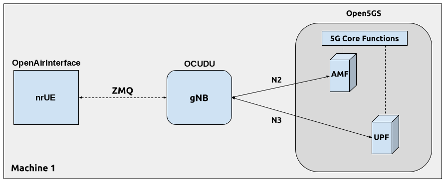

# OCUDU with OpenAirInterface (OAI) UE

:::warning
Improving the interoperability of the OpenAirInterface (OAI) UE is an on-going effort at the Duranta project. This application note is based on the OAI `2026.w25` release and is intended to be used for proof-of-concept and initial testing to allow users to test OCUDU with an open source UE that is in active development. Please reach out to the Duranta community for general feedback and technical support for the OAI UE. 
:::

## Overview

OCUDU is a 5G CU/DU solution and does not include a UE application. The [Duranta OpenAirInterface](https://github.com/duranta-project/openairinterface5g) project includes an open source 5G UE (OAI UE). Unlike the [srsRAN 4G](https://github.com/srsran/srsRAN_4G) project's prototype 5G UE (srsUE), the OAI UE is in active development and is TDD capable. However, the OAI UE prior to `2026.w25` had interoperability issues with OCUDU. Without support for UCI on PUSCH, in particular for multiplexing CSI on PUSCH, the OAI UE could not operate with the OCUDU gNB in UL with CSI RS enabled. Likewise, with CSI RS disabled, DL operation required fixed MCS. 

Historically, the OCUDU and Duranta projects had incompatible virtual radio interfaces, ZeroMQ (ZMQ) and RFSim respectively. The OAI `2026.w17` release introduced a compatible ZMQ radio. While not strictly required for interoperability, this feature  enables testing with no hardware cost.

This application note shows how to create an end-to-end fully open-source 5G TDD network with OAI UE, OCUDU gNodeB and Open5GS 5G core network.

The ZMQ-based virtual radio use case is shown here. Various use cases such as over-the-air hardware setup and multi-UE emulation will be added later.


## Hardware and Software Overview

For this application note, the following hardware and software are used:

- PC with Ubuntu 24.04.3 LTS
- [OCUDU](https://gitlab.com/ocudu)
- [Duranta OpenAirInterface](https://github.com/duranta-project/openairinterface5g) (2026.w25 or later)
- [Two Ettus Research USRP B210s](https://www.ettus.com/all-products/ub210-kit/) (connected over USB3)
- [Open5GS 5G Core](https://open5gs.org/)
- [ZeroMQ](https://zeromq.org/)

:::info
Ideally the USRPs would be connected to a 10 MHz external reference clock or GPSDO, although this is not a strict requirment. We recommend the [Leo Bodnar GPSDO](http://www.leobodnar.com/shop/index.php?main_page=product_info&cPath=107&products_id=234&zenid=5194baec39dbc91212ec4ac755a142b6).
:::

### Duranta OpenAirInterface

If you have not already done so, install the latest version of Duranta OpenAirInterface and all of its dependencies. This is outlined in the [OAI installation guide](https://github.com/duranta-project/openairinterface5g/blob/develop/doc/BUILD.md). 


#### Limitations

The current OAI UE implementation has a few feature limitations:

- With CSI RS enabled on the OCUDU gNB, Tracking Reference Signal (TRS) is not handled by the OAI UE
- **TODO: identify more limitations**

### ZeroMQ

Building and running OAI with ZMQ radio is also documented in the [OAI ZMQ README](https://github.com/duranta-project/openairinterface5g/blob/develop/radio/zmq/README.md).


### Open5GS

For this example, we are using Open5GS as the 5G Core.

Open5GS is a C-language open-source implementation for 5G Core and EPC. The following links will provide you
with the information needed to download and set-up Open5GS so that it is ready to use with OCUDU:

- [GitHub](https://github.com/open5gs/open5gs)
- [Quickstart Guide](https://open5gs.org/open5gs/docs/guide/01-quickstart/)

For the purpose of this application note, we will use a dockerized Open5GS version provided in OCUDU at `ocudu/docker`.


## Over-the-air Setup
**TODO**


## ZeroMQ-based Setup

In this section, we describe the steps required to configure the ZMQ-based RF driver in both OCUDU gNB and OAI UE.
The following diagram presents the setup architecture:



### Configuration

The following config files were modified to use ZMQ-based RF driver:

* [gNB config](assets/gnb_zmq.yaml)
* [UE config](assets/oaiue_zmq.conf)

Details of the modifications made are outlined in following sections.

#### gNB

Replacing the UHD driver with the ZMQ-based RF driver requires changing only **ru_sdr** sections of the gNB file:

```default
ru_sdr:
  device_driver: zmq
  device_args: tx_port=tcp://127.0.0.1:4556,rx_port=tcp://127.0.0.1:4557
  srate: 23.04
  tx_gain: 0
  rx_gain: 0
```

The following cell configuration should be matched by the OAI UE configuration.  

```default
cell_cfg:
  dl_arfcn: 632628
  band: 78
  channel_bandwidth_MHz: 20
  common_scs: 30
```
TDD is enabled by default since the frequency band is **n78**. The following TDD configuration is provided as an example for setting the TDD pattern:

```default
cell_cfg:
  ...
  tdd_ul_dl_cfg:
    dl_ul_tx_period: 5
    nof_dl_slots: 3
    nof_dl_symbols: 10
    nof_ul_slots: 1
    nof_ul_symbols: 2
```
CSI RS is enabled by default. However, when CSI RS is enabled, the number of CSI REs must greater than 0, and up to 8.

```default
cell_cfg:
  ...
  csi:
    csi_rs_enabled: true
  pucch:
    nof_cell_csi_res: 1
```

#### OAI UE

The OAI UE UICC fields should match the subscriber database of the 5G Core Network

```default
uicc0 = {
  imsi = "001010123456780";
  key = "00112233445566778899aabbccddeeff";
  opc= "63bfa50ee6523365ff14c1f45f88737d";
  pdu_sessions = ({ dnn = "internet"; 
                    nssai_sst = 1; 
                    });
}

```

Then, the ZMQ radio driver is configured as follows:

```default
device = {
  name = "oai_zmqdevif";
};

zmq = (
  {
    tx_channels = ( "tcp://127.0.0.1:4557" );
    rx_channels = ( "tcp://127.0.0.1:4556" );
  }
);
```

In addition, match the PRB/bandwith, numerology/SCS, frequency band, and ARFCN/carrier frequency configuration of the gNB:

```default
r               = 51;
numerology      = 1;
band            = 78;
C               = 3489420000;
```
Enable carrier scanning to find the SSB offset automatically. Optionally, enable 3/4 FFT sample rate with the `E` flag to match the gNB. Finally, the UE capabilities file is required for interoperability with any third party gNB. Some example UE capabilities file provided in-tree that work with OCUDU gNB. 

```default
ue-scan-carrier = 1;
E               = 1;
uecap_file      = "../../../targets/PROJECTS/GENERIC-NR-5GC/CONF/uecap_ports1.xml";
```

### Running the Network

Once the config files are updated, the network can be set up on a single host machine.

#### Open5GS Core

OCUDU provides a dockerized version of the Open5GS. It is a convenient and quick way to start the core network. You can run it as follows:

```bash
cd ./ocudu/docker
docker compose up --build 5gc
```

Note that we have already configured Open5GS to operate correctly with OCUDU. Moreover, the UE database is populated with the credentials used by our OAI UE.

#### OCUDU gNB

We run gNB directly from the build folder, i.e., `./ocudu/build/apps/gnb/`, (the config file is also located there) with the following command:

```bash
sudo ./gnb -c ./gnb_zmq.yaml
```

The console output should be similar to:

```bash
--== OCUDU gNB (commit 76a15775c9) ==--

Lower PHY in executor sequential baseband mode.
Available radio types: uhd, zmq and realtime_loopback.
Cell pci=1, bw=20 MHz, 1T1R, dl_arfcn=632628 (n78), dl_freq=3489.42 MHz, dl_ssb_arfcn=632256, ul_freq=3489.42 MHz

N2: Connection to AMF on 10.53.1.2:38412 completed
==== gNB started ===
Type <h> to view help
```

The `Connecting to AMF on 10.53.1.2:38412` message indicates that gNB initiated a connection to the core.
If the connection attempt is successful, the following (or similar) will be displayed on the Open5GS console:

```bash
open5gs_5gc  | 06/25 07:22:50.219: [amf] INFO: gNB-N2 accepted[10.53.1.1]:35496 in ng-path module (../src/amf/ngap-sctp.c:113)
open5gs_5gc  | 06/25 07:22:50.219: [amf] INFO: gNB-N2 accepted[10.53.1.1] in master_sm module (../src/amf/amf-sm.c:894)
open5gs_5gc  | 06/25 07:22:50.222: [amf] INFO: [Added] Number of gNBs is now 1 (../src/amf/context.c:1277)
open5gs_5gc  | 06/25 07:22:50.222: [amf] INFO: gNB-N2[10.53.1.1] max_num_of_ostreams : 30 (../src/amf/amf-sm.c:941)
```

#### OAI UE

Finally, we start OAI UE. This is also done directly from within the build folder i.e., `./openairinterface5g/cmake_targets/ran_build/build/`), with the config file in the same location:

```bash
sudo ./nr-uesoftmodem -O oaiue_zmq.conf
```

If OAI UE connects successfully to the network, the following (or similar) should be displayed on the console:

```bash
[NAS]    Received PDU Session Establishment Accept, UE IPv4: 10.45.1.2
[SDAP]   UE 0 PDU session 1: cached QFI 1
[SDAP]   UE 0 PDU session 1: bringing TUN oaitun_ue1 up
[UTIL]   threadCreate() for ue_tun_read_0_p1: creating thread with affinity ffffffff, priority 1
[OIP]    TUN Interface oaitun_ue1 successfully configured, IPv4 10.45.1.2, IPv6 (null)
[NR_MAC] [157.7] Received TA_COMMAND 30 TAGID 0 CC_id 0
Entering ITTI signals handler
TYPE <CTRL-C> TO TERMINATE
[NR_MAC] UE 0 RNTI 4601 stats sfn: 256.4, cumulated bad DCI 0
    DL harq: 19/0
    UL harq: 9/0 avg code rate 0.9, avg bit/symbol 5.0, avg per TB: (nb RBs 7.0, nb symbols 14.0)
[NR_MAC] UE 0 RNTI 4601 stats sfn: 384.4, cumulated bad DCI 0
    DL harq: 19/0
    UL harq: 9/0 avg code rate 0.9, avg bit/symbol 5.0, avg per TB: (nb RBs 7.0, nb symbols 14.0)
```

It is clear that the connection has been made successfully once the UE has been assigned an IP, this is seen in `Received PDU Session Establishment Accept, UE IPv4: 10.45.1.2`.
The TUN Interface is then confirmed with the `TUN Interface oaitun_ue1 successfully configured, IPv4 10.45.1.2, IPv6 (null)` message.

### Testing the Network

#### Routing Configuration

The OAI UE application configures the TUN interface and IP routing. Verify TUN interface:

```bash
ip addr show oaitun_ue1
```
It should show:
```bash
371: oaitun_ue1: <POINTOPOINT,NOARP,UP,LOWER_UP> mtu 1500 qdisc fq_codel state UNKNOWN group default qlen 500
    link/none
    inet 10.45.1.2/24 scope global oaitun_ue1
       valid_lft forever preferred_lft forever
    inet6 fe80::c0de:8b89:4908:d1ac/64 scope link stable-privacy
       valid_lft forever preferred_lft forever
```
Check the route from the UE IP (10.45.1.2) to the 5G Core container IP (10.53.1.2)

```bash
ip route get 10.53.1.2 from 10.45.1.2
```

It should show the policy-based routing rule configured in the OAI UE [source code](https://github.com/duranta-project/openairinterface5g/blob/31eb466a7d598a7f0a8850b0a7405dca16290b9a/common/utils/tuntap_if.c#L268):

```bash
10.53.1.2 from 10.45.1.2 dev oaitun_ue1 table 9999 uid 1000
    cache
```

#### Ping

##### Uplink

To test the connection in the uplink direction, run ping from the host OS:

```default
ping -I 10.45.1.2 10.53.1.2 -c 3
```

##### Downlink

Run the downlink ping from inside the 5G Core container:

```default
docker exec -it open5gs_5gc ping 10.45.1.2 -c 3
```

##### Ping Output

Example **ping** output:

```default
PING 10.45.1.2 (10.45.1.2) 56(84) bytes of data.
64 bytes from 10.45.1.2: icmp_seq=1 ttl=64 time=34.0 ms
64 bytes from 10.45.1.2: icmp_seq=2 ttl=64 time=41.6 ms
64 bytes from 10.45.1.2: icmp_seq=3 ttl=64 time=39.9 ms

--- 10.45.1.2 ping statistics ---
3 packets transmitted, 3 received, 0% packet loss, time 2002ms
rtt min/avg/max/mdev = 34.000/38.490/41.586/3.250 ms
```

#### iPerf3

##### Network-side (Server)

Start the iPerf3 server inside the 5G Core container:

```default
docker exec -it open5gs_5gc iperf3 -s -i 1
```

The server listens for traffic coming from the UE. After the client connects, the server prints flow measurements every second.

##### UE-side (Client)

With the network and the iPerf3 server up and running, the client can be run on the host OS by binding to the UE TUN interface IP:

```default
# UL
 iperf3 -c 10.53.1.2 -B 10.45.1.2 -t 10 -i 1
# DL
 iperf3 -c 10.53.1.2 -B 10.45.1.2 -t 10 -i 1 -R
```

Traffic will now be sent from the UE to the network. This will be shown in both the server and client consoles. Additionaly, we will observe console traces of the gNB.


##### Iperf3 Output

Example **server** iPerf3 output:

```default
# iperf3 -s -i 1
-----------------------------------------------------------
Server listening on 5201
-----------------------------------------------------------
Accepted connection from 10.45.1.2, port 50253
[  5] local 10.53.1.2 port 5201 connected to 10.45.1.2 port 38587
[ ID] Interval           Transfer     Bitrate
[  5]   0.00-1.07   sec  1.88 MBytes  14.7 Mbits/sec
[  5]   1.07-2.14   sec  1.62 MBytes  12.8 Mbits/sec
[  5]   2.14-3.13   sec  1.62 MBytes  13.8 Mbits/sec
[  5]   3.13-4.12   sec  1.75 MBytes  14.9 Mbits/sec
[  5]   4.12-5.23   sec  1.25 MBytes  9.36 Mbits/sec
[  5]   5.23-6.30   sec   896 KBytes  6.89 Mbits/sec
[  5]   6.30-7.27   sec   768 KBytes  6.48 Mbits/sec
[  5]   7.27-8.16   sec   896 KBytes  8.23 Mbits/sec
[  5]   8.16-9.25   sec  1.00 MBytes  7.71 Mbits/sec
[  5]   9.25-10.23  sec   896 KBytes  7.51 Mbits/sec
[  5]  10.23-10.77  sec   512 KBytes  7.72 Mbits/sec
- - - - - - - - - - - - - - - - - - - - - - - - -
[ ID] Interval           Transfer     Bitrate
[  5]   0.00-10.77  sec  13.0 MBytes  10.1 Mbits/sec                  receiver
```

Example **client** iPerf3 output:

```default
# iperf3 -c 10.53.1.2 -B 10.45.1.2 -t 10 -i 1
Connecting to host 10.53.1.2, port 5201
[  5] local 10.45.1.2 port 38587 connected to 10.53.1.2 port 5201
[ ID] Interval           Transfer     Bitrate         Retr  Cwnd
[  5]   0.00-1.00   sec  2.62 MBytes  22.0 Mbits/sec    0    164 KBytes
[  5]   1.00-2.00   sec  1.62 MBytes  13.6 Mbits/sec    0    243 KBytes
[  5]   2.00-3.00   sec  2.38 MBytes  19.9 Mbits/sec    0    325 KBytes
[  5]   3.00-4.00   sec  2.25 MBytes  18.9 Mbits/sec    0    416 KBytes
[  5]   4.00-5.00   sec  1.00 MBytes  8.39 Mbits/sec    0    481 KBytes
[  5]   5.00-6.00   sec  1.00 MBytes  8.39 Mbits/sec    0    523 KBytes
[  5]   6.00-7.00   sec  1.00 MBytes  8.39 Mbits/sec    0    563 KBytes
[  5]   7.00-8.00   sec  1.25 MBytes  10.5 Mbits/sec    0    609 KBytes
[  5]   8.00-9.00   sec  1.25 MBytes  10.5 Mbits/sec    0    655 KBytes
[  5]   9.00-10.00  sec  1.25 MBytes  10.5 Mbits/sec    0    703 KBytes
- - - - - - - - - - - - - - - - - - - - - - - - -
[ ID] Interval           Transfer     Bitrate         Retr
[  5]   0.00-10.00  sec  15.6 MBytes  13.1 Mbits/sec    0             sender
[  5]   0.00-10.77  sec  13.0 MBytes  10.1 Mbits/sec                  receiver
```

##### OCUDU gNB Console Traces

During iPerf3 UL test:

```default
          |--------------------DL---------------------|-------------------------------UL-----------------------------
 pci rnti | cqi  ri  mcs  brate   ok  nok  (%)  dl_bs | pusch  rsrp  ri  mcs  brate   ok  nok  (%)    bsr     ta  phr
   1 4601 |  15 1.0   24   1.0M  729    8   1%      7 |  39.8 -35.2   1   27  16.5M  400    0   0%   700k   281n   38
   1 4601 |  15 1.0   24   1.0M  735    7   0%      0 |  39.8 -35.2   1   27  16.5M  400    0   0%   700k   281n   38
   1 4601 |  15 1.0   24   1.1M  760    5   0%      7 |  39.8 -35.2   1   27  16.5M  400    0   0%   700k   281n   38
   1 4601 |  15 1.0   24   1.0M  747    7   0%      7 |  39.8 -35.2   1   27  16.6M  400    0   0%   700k   281n   38
   1 4601 |  15 1.0   24   987k  698    9   1%      7 |  39.8 -35.2   1   27  16.5M  400    0   0%   700k   281n   38
   1 4601 |  15 1.0   24   930k  672    6   0%      7 |  39.8 -35.2   1   27  16.5M  400    0   0%   700k   281n   38
   1 4601 |  15 1.0   24   1.2M  802    7   0%      0 |  39.8 -35.2   1   27  15.6M  387    0   0%      0   281n   38
   1 4601 |  15 1.0   24   8.1k    5    0   0%      0 |  39.9 -35.2   1   27  9.73k    2    0   0%      0   298n   38
   1 4601 |  15 1.0    0      0    0    0   0%      0 |   n/a   n/a   1    0      0    0    0   0%      0   303n   38
```


During iPerf3 DL test:

```default
          |--------------------DL---------------------|-------------------------------UL-----------------------------
 pci rnti | cqi  ri  mcs  brate   ok  nok  (%)  dl_bs | pusch  rsrp  ri  mcs  brate   ok  nok  (%)    bsr     ta  phr
   1 4601 |  15 1.0    0      0    0    0   0%      0 |   n/a   n/a   1    0      0    0    0   0%      0   303n   38
   1 4601 |  15 1.0   20   1.9M   93  297  76%  42.2k |  40.1 -35.2   1   27   120k   22    0   0%      0   290n   38
   1 4601 |  15 1.0   19   7.7M  316 1037  76%  46.1k |  40.2 -35.2   1   27   344k   48    0   0%      0   273n   38
   1 4601 |  14 1.0   18   6.7M  323  814  71%  11.3k |  40.1 -35.2   1   27   326k   48    0   0%      0   280n   38
   1 4601 |  15 1.0   19   5.0M  221  559  71%      0 |  40.1 -35.2   1   27   232k   41    0   0%      0   288n   38
   1 4601 |  15 1.0   19   5.5M  242  791  76%  28.9k |  39.9 -35.2   1   27   302k   49    0   0%      0   287n   38
   1 4601 |  15 1.0   19   5.9M  259  865  76%    15k |  39.9 -35.2   1   27   306k   49    0   0%      0   284n   38
   1 4601 |  15 1.0   19   6.2M  258  859  76%  16.3k |  40.0 -35.2   1   27   288k   47    0   0%      0   284n   38
   1 4601 |  15 1.0   19   6.7M  279  860  75%  15.5k |  39.9 -35.2   1   27   302k   47    0   0%      0   284n   38
   1 4601 |  15 1.0   19   5.7M  243  730  75%      0 |  39.8 -35.2   1   27   280k   47    0   0%      0   292n   38
```


## Multi-UE Emulation

**TODO**

## Troubleshooting

**TODO**

## Limitations

**TODO**
