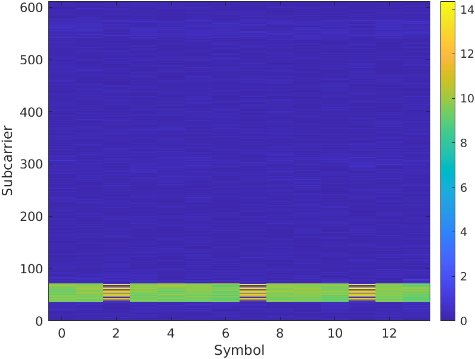
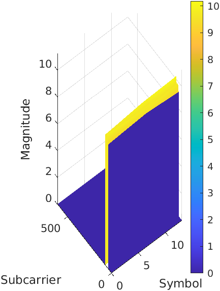
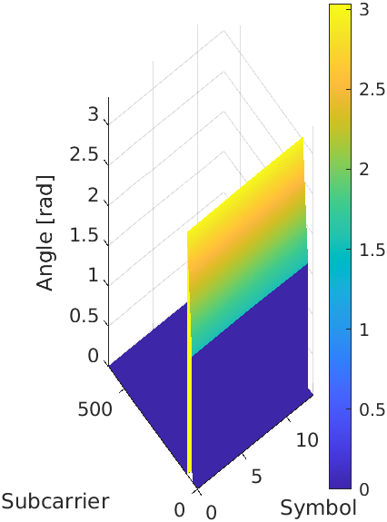
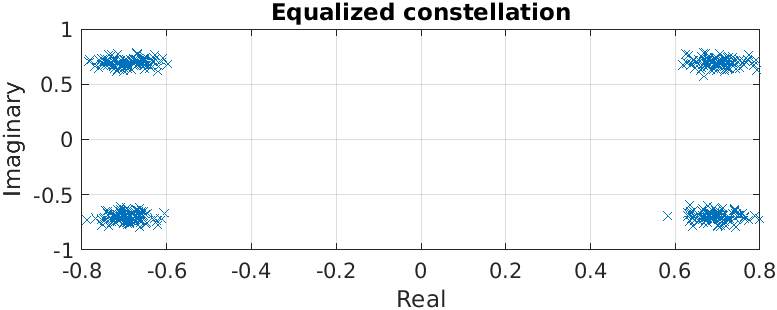
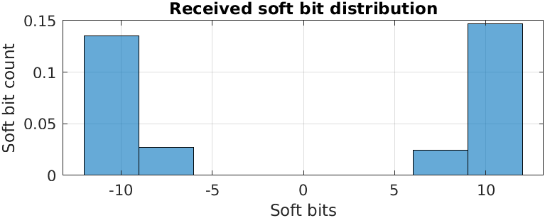
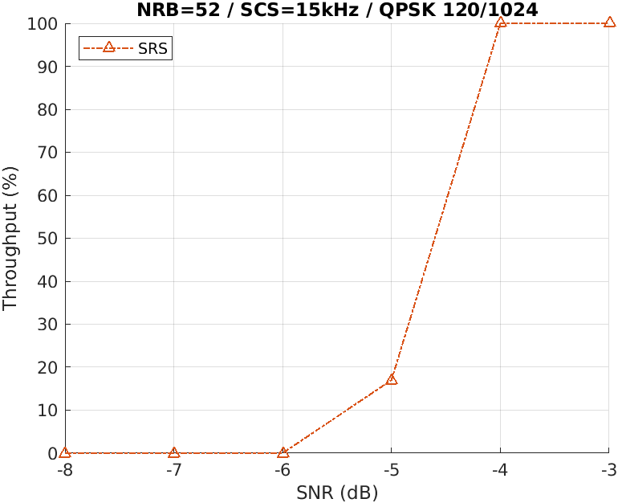

import Tabs from '@theme/Tabs';
import TabItem from '@theme/TabItem';

# MATLAB Testing Tools

## Overview

This tutorial explains the main features of [srsRAN-matlab](https://github.com/srsran/srsRAN_matlab), a MATLAB-based project for testing
OCUDU. More specifically, this tutorial will show how to generate a new set of test vectors for the OCUDU tests, how to analyze the uplink IQ samples recorded by the OCUDU gNB, and how to run end-to-end,
link-level simulations for testing PHY components of OCUDU. This will be done across three independent sections.

srsRAN-matlab offers three main tools: the test vector generators, the uplink analyzers and the link-level simulators.

### Test Vector Generation

Test vectors are mainly used to test, develop and debug the PHY components of OCUDU. This tutorial will show
how to generate the set of vectors used for unit testing inside the OCUDU repository. As well as outlining how to generate a
new set of random vectors for broadening the extent of the tests.

### Signal Analyzers

The signal analyzers are useful for testing the uplink chain of the gNB. Specifically, they provide visual hints about the
signal quality in the uplink slots.

### Simulators

The simulators can be used to estimate the performance of the PHY uplink channels under different configurations and channel
conditions provided by MATLAB’s 3GPP-compliant models.

## Set-Up Considerations

For this application note, the following hardware and software are used:

- A PC with Ubuntu 22.04.3 LTS
- [srsRAN-matlab](https://github.com/srsran/srsRAN_matlab)
- [OCUDU](https://gitlab.com/ocudu/ocudu)
- MathWorks [MATLAB](https://www.mathworks.com/products/matlab.html) (R2022b or R2023a) with the [5G Toolbox](https://www.mathworks.com/products/5g.html?s_tid=srchtitle_site_search_1_5g%20toolbox)

:::info
Running the srsRAN-matlab testing suite requires a working copy of MATLAB and its 5G Toolbox
:::

## Installation

Assuming that OCUDU and MATLAB have both been downloaded and installed, the next step is to download srsRAN-matlab.

This can be done with the following command:

```bash
git clone https://github.com/srsran/srsRAN_matlab.git
```

:::info
This tutorial assumes that OCUDU is installed in the users come directory.
:::

Once it has been downloaded, the working directory for srsRAN-matlab should be added to MATLAB’s search path. This can be done from the MATLAB console with the following command:

```matlab
cd ~/srsRAN_matlab
addpath .
```

To verify you have added srsRAN-matlab successfully to MATLAB’s search path, run the following command (again from the MATLAB console):

```matlab
runtests('unitTests', Tag='matlab code')
```

If successful, the following output should be shown at the end of the console output:

```matlab
ans =

  1x94 TestResult array with properties:

    Name
    Passed
    Failed
    Incomplete
    Duration
    Details

Totals:
   94 Passed, 0 Failed, 0 Incomplete.
   42.2176 seconds testing time.
```

---

<Tabs>

  <TabItem value="vectors" label="Test Vectors" default>


The PHY components of OCUDU are tested by feeding each component with vectors of input data and
comparing the resulting output with their expected values. In OCUDU, the test vectors for a
PHY component usually consist of a number of binary files with input and output data, and a single shared header file
that describes the test set-up and the content of the binary files. The binary files are packed in a single tarball.
For example, the test vectors of the channel estimator are provided by the files `port_channel_estimator_test_data.h` and
`port_channel_estimator_test_data.tar.gz` in `~/ocudu/tests/unittests/phy/upper/signal_processors`.

The files `srs<ComponentName>Unittest.m` in the main directory of `srsRAN-matlab` provide the classes for
generating such PHY input-output test vectors. This is done by leveraging MATLAB 5G Toolbox. These classes inherit from
the MATLAB `matlab.unittest.TestCase` class, meaning all of the tools within MATLAB’s unit
testing framework can be used with them. To facilitate the generation of test vectors, a simplified interface
is provided with srsRAN-matlab.

To generate the test vectors for all PHY components the following code needs to be run from the MATLAB console:

```matlab
runSRSRANUnittest('all', 'testvector')
```

This will generate a `.h` and `.tar.gz` file for each of the PHY components and place them in the folder `~/srsRAN_matlab/testvector_outputs`..

The test vectors for a single PHY component can also be generated. This is done by replacing `all` with the name of the desired
component, as per its declaration in `~/srsRAN_Project/include/srsran/`. For example, the test vectors for the channel estimator,
whose interface is declared in `~/srsRAN_Project/include/srsran/phy/upper/signal_processors/port_channel_estimator.h`, can be
generated with the following command:

```matlab
runSRSRANUnittest('port_channel_estimator', 'testvector')
```

Once the test vectors have been generated, the pairs of `.h` and `tar.gz` files in the `testvector_outputs` folder
can be transferred to OCUDU folder with the MATLAB command:

```matlab
srsTest.copySRStestvectors('testvector_outputs', '~/srsRAN_Project/')
```

This command will automatically copy all test vectors to the proper subdirectory inside `~/srsRAN_Project/tests/unittests/phy`.

By default, executing `runSRSRANUnittest` will reproduce the same test vectors as the ones provided with
OCUDU repository. To generate a random set of vectors, we simply need to add the `RandomShuffle`
option. This can be done with the following command:

```matlab
runSRSRANUnittest('all', 'testvector', RandomShuffle=true)
```


  </TabItem>

  <TabItem value="analyzers" label="Analyzers">

srsRAN-matlab provides some tools to analyze the signal received by the srsRAN gNB and help debugging the uplink channels. These
can be found in `apps/analyzers`. In this tutorial, we will focus on the analyzer for PUSCH transmissions; for the other
analyzers, which are very similar, please follow the instruction in their help text.

The following shows some of the other analyzer options:

```matlab
% The Resource Grid analyzers only plots the energy map of a slot.
>> help srsResourceGridAnalyzer

% For analyzing PUCCH transmissions.
>> help srsPUCCHAnalyzer

% For analyzing PRACH transmissions.
>> help srsPRACHAnalyzer
```

To use the PUSCH analyzer, the gNB needs to be configured to collect IQ samples. This can be done with by adding the following to
the gNB configuration file:

```yaml
log:
  filename: /tmp/gnb.log                         # save the log to a specified file
  phy_level: debug                               # debug log level for PHY layer set to debug
  phy_rx_symbols_filename: /tmp/iq.bin           # save IQ samples to a specified file
```

The gNB can then be run as normal. The IQ samples will then be generated. This can be done with the following command:

```bash
sudo ./gnb -c config.yml
```

:::note
The generated IQ samples will occupy a large amount of disk space. It is recommended to not run the gNB with this configuration for too long.
:::

After running the gNB, open the `gnb.log` and locate a PUSCH transmission to analyze. The following example shows the PUSCH transmission that will be
analyzed in this tutorial:

```bash
2023-10-08T19:14:54.738749 [Upper PHY] [I] [  690.17] RX_SYMBOL: sector=0 offset=79705 size=8568
2023-10-08T19:14:54.738854 [UL-PHY1 ] [D] [  690.17] PUSCH: rnti=0x4601 h_id=0 prb=[3, 6) symb=[0, 14) mod=QPSK rv=0 tbs=11 crc=OK iter=1.0 sinr=20.1dB t=182.0us
   rnti=0x4601
   h_id=0
   bwp=[0, 51)
   prb=[3, 6)
   symb=[0, 14)
   oack=0
   ocsi1=0
   part2=entries=[]
   alpha=0.0
   betas=[0.0, 0.0, 0.0]
   mod=QPSK
   tcr=0.1171875
   rv=0
   bg=2
   new_data=true
   n_id=1
   dmrs_mask=00100001000100
   n_scr_id=1
   n_scid=false
   n_cdm_g_wd=2
   dmrs_type=1
   lbrm=3168bytes
   slot=690.17
   cp=normal
   nof_layers=1
   ports=0
   dc_position=306
   crc=OK
   iter=1.0
   max_iter=1
   min_iter=1
   nof_cb=1
   sinr_ch_est=26.9dB
   sinr_eq=23.9dB
   sinr_evm[sel]=20.1dB
   evm=0.06
   epre=+22.7dB
   rsrp=+22.7dB
   t_align=-0.2us
```

Once the transmission has been located and selected, its description can be used to populate configuration options in the srsRAN-matlab analyzer.

From the MATLAB console, run the following command:

```matlab
cd apps/analyzers
[carrier, pusch, extra] = srsParseLogs
```

You will then see the following output:

```matlab
Copy the relevant section of the logs to the system clipboard (typically select and Ctrl+C), then switch back to MATLAB and press any key.
Parsing the following log section:
```

You should then copy the selected PUSCH transmission details from the log file, and paste it directly into the MATLAB console. The output should look like the following:

```bash
2023-10-08T19:14:54.738854 [UL-PHY1 ] [D] [  690.17] PUSCH: rnti=0x4601 h_id=0 prb=[3, 6) symb=[0, 14) mod=QPSK rv=0 tbs=11 crc=OK iter=1.0 sinr=20.1dB t=182.0us
  rnti=0x4601
  h_id=0
  bwp=[0, 51)
  prb=[3, 6)
  symb=[0, 14)
  oack=0
  ocsi1=0
  part2=entries=[]
  alpha=0.0
  betas=[0.0, 0.0, 0.0]
  mod=QPSK
  tcr=0.1171875
  rv=0
  bg=2
  new_data=true
  n_id=1
  dmrs_mask=00100001000100
  n_scr_id=1
  n_scid=false
  n_cdm_g_wd=2
  dmrs_type=1
  lbrm=3168bytes
  slot=690.17
  cp=normal
  nof_layers=1
  ports=0
  dc_position=306
  crc=OK
  iter=1.0
  max_iter=1
  min_iter=1
  nof_cb=1
  sinr_ch_est=26.9dB
  sinr_eq=23.9dB
  sinr_evm[sel]=20.1dB
  evm=0.06
  epre=+22.7dB
  rsrp=+22.7dB
  t_align=-0.2us
```

The function will show the log for confirmation and ask for the sub-carrier spacing and the number of RBs in the resource grid:

```matlab
Do you want to continue? [Y]/N y
Subcarrier spacing in kHz: 30
Grid size as a number of RBs: 51
```

Finally, `srsParseLogs` returns an nrCarrierConfig object, carrier, an nrPUSCHConfig object, pusch, and the extra structure with
additional information about the PUSCH transport block. It should look like the following:

```matlab
carrier =

  nrCarrierConfig with properties:

              NCellID: 1
    SubcarrierSpacing: 30
         CyclicPrefix: 'normal'
            NSizeGrid: 51
           NStartGrid: 0
                NSlot: 17
               NFrame: 690

   Read-only properties:
       SymbolsPerSlot: 14
     SlotsPerSubframe: 2
        SlotsPerFrame: 20

pusch =

  nrPUSCHConfig with properties:

              NSizeBWP: 51
             NStartBWP: 0
            Modulation: 'QPSK'
             NumLayers: 1
           MappingType: 'A'
      SymbolAllocation: [0 14]
                PRBSet: [3 4 5]
    TransformPrecoding: 0
    TransmissionScheme: 'nonCodebook'
       NumAntennaPorts: 1
                  TPMI: 0
      FrequencyHopping: 'neither'
     SecondHopStartPRB: 1
         BetaOffsetACK: 20
        BetaOffsetCSI1: 6.2500
        BetaOffsetCSI2: 6.2500
            UCIScaling: 1
                   NID: 1
                  RNTI: 17921
                NRAPID: []
                  DMRS: [1x1 nrPUSCHDMRSConfig]
            EnablePTRS: 0
                  PTRS: [1x1 nrPUSCHPTRSConfig]

extra =

  struct with fields:

                      RV: 0
          TargetCodeRate: 0.1172
    TransportBlockLength: 88
              dcPosition: 306
```

The final step is to run the PUSCH analyzer, providing as inputs the objects just created by `srsParseLogs`,
the path to the IQ record, the offset and the length of the slot (both expressed as a number of IQ samples).
Both the offset and the length of the slot can be found in the log file, on a line like the following one

```matlab
2023-10-08T19:14:54.738749 [Upper PHY] [I] [  690.17] RX_SYMBOL: sector=0 offset=79705 size=8568
```

:::info
The slot ID (`[  690.17]` in our example) should be the same as that of the PUSCH log.
:::

The command to run the PUSCH analyzer from the MATLAB console is:

```matlab
srsPUSCHAnalyzer(carrier, pusch, extra, '/tmp/iq.bin', 79705, 8568)
The block CRC is OK.
```

This should then output figures displaying the slot energy distribution, the magnitude of the estimated channel, the phase of
the estimated channel, the equalized constellation and the received soft bit distribution.

The following figures show these:

| Slot Energy Distribution                                      | Magnitude of the Estimated Channel                           | Phase of the Estimated Channel                           |
|---------------------------------------------------------------|--------------------------------------------------------------|----------------------------------------------------------|
|  |  |  |

|    |    |
|--------------------------------------------------------------------|---------------------------------------------------------------|

  </TabItem>

  <TabItem value="simulators" label="Simulators">

This example demonstrates how to test the throughput and BLER performance of the srsRAN gNB’s own PUSCH processor using srsRAN-matlab simulators. By leveraging MATLAB’s 5G Toolbox
we can build a simulation set-up that is as close as possible to the one required by 3GPP conformance tests (see TS38.104 and TS38.141). Although not fully representative
of a real-world deployment with RUs and over-the-air transmission, these simulation are useful for obtaining a first estimation of the performance of the system.

**Compiling the MEXs**

The inclusion of OCUDU PHY blocks into a MATLAB simulator is achieved by means of [MEX
functions](https://www.mathworks.com/help/matlab/call-mex-file-functions.html), which are small C++ libraries that can be called from MATLAB. Therefore, the first step for running
the srsRAN-matlab simulators is to build the MEX executables.

First, we compile OCUDU with the `ENABLE_EXPORT` flag, to export (some of) its libraries for external
projects. This can be done from the command line with the following command:

```bash
cd ~/ocudu
cmake -B buildExport -DENABLE_EXPORT:BOOL=ON
cmake --build buildExport -j 'nproc'
```

This builds OCUDU inside `buildExport` and generates the file `buildExport/srsran.cmake`, which
provides all the details required to import the necessary srsRAN CMake targets from external projects.

:::info
The `ENABLE_EXPORT` flag implies the generation of position-independent code (with the `-fPIC` compiler option) - as
a result, you may experience reduced performance when running the gNB.
:::

The MEX libraries should now be built for srsRAN-matlab. From the command line, run the following:

```bash
cd ~/srsRAN_matlab/+srsMEX/source
cmake -B buildMEX -DSRSRAN_BINARY_DIR:PATH="~/srsRAN_Project/buildExport" -DMatlab_ROOT_DIR:PATH="/path/to/MATLAB/R2023a"
cmake --build buildMEX -j 'nproc'
```

To check that the above was run successfully, execute the following command from the main srsRAN-matlab directory:

```default
runtests('unitTests', Tag='mex code')
```

This should output the following, or similar:

```matlab
ans =

  1x45 TestResult array with properties:

    Name
    Passed
    Failed
    Incomplete
    Duration
    Details

Totals:
   6 Passed, 0 Failed, 39 Incomplete.
   14.7124 seconds testing time.
```

You can then run:

```matlab
runSRSRANUnittest('all', 'testmex')
```

If successful, the `runSRSRANUnittest` will generate test vectors, these will be fed into the MEX versions of OCUDU PHY components. An output similar to the following will be shown:

```matlab
Failure Summary:

     Name                                                                                                                                                                                         Failed  Incomplete  Reason(s)
    ==========================================================================================================================================================================================================================================
     srsPRACHDetectorUnittest[RandomDefault=true#ext,outputPath=_home_david_Code_MATLAB_srsgnb_matlab_testvector_outputs#ext]/mexTest(DuplexMode=FDD,PreambleFormat=1,UseZCZ=false,nAntennas=1)               X       Filtered by assumption.
    ------------------------------------------------------------------------------------------------------------------------------------------------------------------------------------------------------------------------------------------
     srsPRACHDetectorUnittest[RandomDefault=true#ext,outputPath=_home_david_Code_MATLAB_srsgnb_matlab_testvector_outputs#ext]/mexTest(DuplexMode=FDD,PreambleFormat=1,UseZCZ=false,nAntennas=2)               X       Filtered by assumption.
    ------------------------------------------------------------------------------------------------------------------------------------------------------------------------------------------------------------------------------------------

...

     srsPRACHDetectorUnittest[RandomDefault=true#ext,outputPath=_home_david_Code_MATLAB_srsgnb_matlab_testvector_outputs#ext]/mexTest(DuplexMode=TDD,PreambleFormat=A1,UseZCZ=true,nAntennas=2)               X       Filtered by assumption.
    ------------------------------------------------------------------------------------------------------------------------------------------------------------------------------------------------------------------------------------------
     srsPRACHDetectorUnittest[RandomDefault=true#ext,outputPath=_home_david_Code_MATLAB_srsgnb_matlab_testvector_outputs#ext]/mexTest(DuplexMode=TDD,PreambleFormat=A1,UseZCZ=true,nAntennas=4)               X       Filtered by assumption.
```

Where only `Incomplete` tests should show. If a test shows as `Failed` an error has occurred.

**Running the PUSCH Simulator**

In the MATLAB console, from the main srsRAN-matlab directory, a simulator object can be created as follows:

```matlab
cd apps/simulators/PUSCHBLER
sim = PUSCHBLER
```

This should give the following output:

```matlab
sim =

  PUSCHBLER with properties:

   Configuration
                         NCellID: 1
                            RNTI: 1
               SubcarrierSpacing: 15
                    CyclicPrefix: 'Normal'
                       NSizeGrid: 52
                          PRBSet: [0 1 2 3 4 5 6 7 8 9 10 ... ]
                SymbolAllocation: [0 14]
                     MappingType: 'A'
           DMRSConfigurationType: 1
                      DMRSLength: 1
          DMRSAdditionalPosition: 1
               DMRSTypeAPosition: 2
                        MCSTable: 'qam64'
                        MCSIndex: 0
                         NRxAnts: 1
                         NTxAnts: 1
                       NumLayers: 1
                    DelayProfile: 'AWGN'
         PerfectChannelEstimator: true
                      EnableHARQ: false
              ImplementationType: 'matlab'
                 QuickSimulation: true
    DisplaySimulationInformation: false
              DisplayDiagnostics: false
```

The simulation set-up can now be modified as desired by the user. In particular, the `ImplementationType` should be changed to `srs`. Doing
so allows the PHY components of OCUDU to be used (via the MEX libraries above) instead of those from the MATLAB 5G Toolbox.

This can be done with the following command:

```matlab
sim.ImplementationType = 'srs'
```

A simulation can then be run to evaluate the throughput and BLER of the PUSCH transmission. This can be done by running `sim([SNR Range], [# Frames])`. An example simulation may look like the following:

```matlab
sim(-8:-3, 10)
```

The resulting throughput and BLER estimations can then be plot with the following command:

```matlab
sim.plot()
```

This will give the following output:

|    |    |
|---------------------------------------------------------|-----------------------------------------------------------|

  </TabItem>

</Tabs>